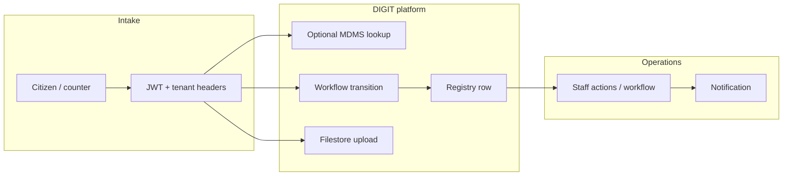
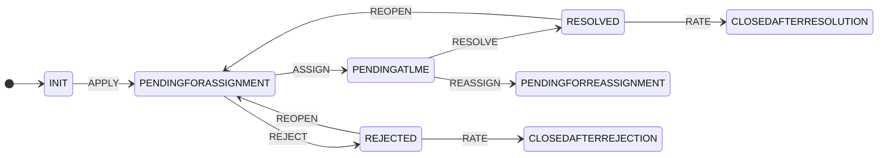

# Building a public service on DIGIT

This tutorial is a **practical sequence** for teams implementing citizen-facing flows on DIGIT: **licenses, permits, complaints, registrations, utility connections, tax/fee collection**, and similar. It assumes you run the **local core stack** (`deploy/local`) and reuse the **provision scripts** under `deploy/local/provision/` as a blueprint.

**How to read this doc:** Start with **§2 SDK-first flow** for the recommended **Account → configuration → setup → test** sequence using **`digit-java-client`**. **§5** (subsections 5.1–5.10) is the **reference** for YAML/JSON shapes and HTTP details. **§6** is **optional shell automation** (`up-and-provision.sh`). Later sections cover design variants and checklists.

DIGIT is a **platform**: you combine **tenant + identity**, **master data (MDMS)**, **structured records (registry)**, **process (workflow)**, **files (filestore)**, **geography (boundary)**, **identifiers (idgen)**, and **notifications**—then add your **application UI/API** and any **payment** integration.

---

## 1. What you are building

A “public service” here means:

| Capability | DIGIT building block | Your responsibility |
|------------|----------------------|----------------------|
| Who is calling | Keycloak (realm, clients, users, roles) | Map roles to workflow `attributes.roles` and app RBAC |
| Which government / tenant | Account API + `X-Tenant-ID` (realm code) | One realm per tenant model; headers on every call |
| Jurisdiction / area | Boundary service | Load polygons/points; validate user selection |
| Dropdowns, slabs, config | MDMS (schema + data) | Design codes your app understands |
| Long-lived case record | Registry (JSON Schema per `schemaCode`) | Define schema + create/update rows |
| Process / SLA / routing | Workflow (process, states, actions) | Model states; wire staff actions |
| Attachments | Filestore (document categories) | Categories, size/format rules |
| Public IDs | IdGen templates | Template per business ID type |
| Alerts | Notification / templates | Template IDs, localization |
| Money | Billing / payment gateway (often outside core) | Policy, reconciliation, receipts |

There is usually **no separate “complaints microservice”** in core: the **same pattern** applies—your **schema** and **workflow** differ by domain.

---

## 2. SDK-first tutorial flow (Java `digit-java-client`)

Use this as the **main spine** of the tutorial. It mirrors **account setup → platform configuration → service configuration → service setup → service test**, but uses **clients from** `digit-client-tools/client-libraries/digit-java-client` wherever the SDK already wraps the API.

**Dependency (Maven):** add the `digit-java-client` artifact from that module’s `pom.xml` to your app (or consume the JAR from your build). **Java 17+**, **Spring 6** as in the library README.

**RestTemplate + headers:** configure service base URLs to match local compose (see defaults below). Enable **header propagation** so every call carries **`Authorization`**, **`X-Tenant-ID`** (realm code after tenant exists), and **`X-Client-ID`** / **`X-Client-Id`** (Keycloak `sub`)—see **`digit-java-client` README** (`HeaderPropagationInterceptor`, `digit.propagate.headers.allow`).

**Local compose base URLs (typical):**

| Client | Property | Example value |
|--------|----------|----------------|
| `AccountClient` | `digit.services.account.base-url` | `http://localhost:8094` |
| `BoundaryClient` | `digit.services.boundary.base-url` | `http://localhost:8093` |
| `WorkflowClient` | `digit.services.workflow.base-url` | `http://localhost:8085` |
| `MdmsClient` | `digit.services.mdms.base-url` | `http://localhost:8099` |
| `IdGenClient` | `digit.services.idgen.base-url` | `http://localhost:8100` |
| `FilestoreClient` | `digit.services.filestore.base-url` | `http://localhost:8102` |

Registry has **no `RegistryClient` in Java yet**—use **`RestTemplate`** (or **`digit-cli` / Go client**) for registry HTTP as in **§5.2** / **§5.5**.

---

### 2.1 Phase 1 — Account setup (`AccountClient`)

Tenant creation uses the **Account API** and does **not** use the tenant JWT yet. The service expects **`X-Client-Id`** for the caller (e.g. `test-client` in local provision).

```java
import com.digit.factory.DigitClientFactory;
import com.digit.services.account.AccountClient;
import com.digit.services.account.model.Tenant;

// Base URL = account service root (client appends /account/v1)
AccountClient account = DigitClientFactory.createAccountClient("http://localhost:8094");

Tenant tenant = Tenant.builder()
    .name("My Municipality")
    .emailId("admin@mymunicipality.gov")
    .build();

// Ensure your RestTemplate adds header X-Client-Id: test-client (or your account client id)
Tenant created = account.createTenant(tenant);
String realmCode = created.getCode(); // use as X-Tenant-ID for all later calls
```

After this, complete **Keycloak** realm bootstrap (OAuth client, admin user, roles) the way **`run-full-provision.sh`** does—or your ops runbook. The SDK does not create Keycloak clients; **Account** only creates the tenant record.

---

### 2.2 Phase 2 — Platform & service **configuration** (SDK + gaps)

| Step | Purpose | Use SDK? | Notes |
|------|---------|----------|--------|
| Boundaries | Jurisdiction geometry | **Yes** — `BoundaryClient.createBoundaries(List<Boundary>)` | Build `Boundary` models or load from YAML via your parser |
| Core registry schema (`core.facility`) | Platform registry | **No Java client** | **`digit create-registry-schema`** or `RestTemplate` → **§5.2** |
| IdGen template `registryId` | Registry business ids | **No template-CRUD in Java** | **`digit create-idgen-template`** once per tenant |
| MDMS **schema + seed data** | Master lists | **No** — `MdmsClient` only **search/validate** existing rows | **`digit create-schema`**, **`digit create-mdms-data`** (see **`service-setup.sh`**) |
| Registry **case schema** (`complaints.case`) | Case JSON shape | **No Java client** | **`digit create-registry-schema --file …/case-registry-schema.yaml`** |
| Workflow **definition** (PGR67 YAML) | States/actions | **No** — `WorkflowClient` runs **instances**, not definition upload | **`digit create-workflow --file example-workflow.yaml`** |
| Filestore **category** | Attachments | **Limited** — `FilestoreClient` is not category-create in current API | **`digit create-document-category`** or HTTP |
| Keycloak **roles** | Match `attributeValidation.roles` | **No** | **`digit create-role`** / admin console |

**After configuration**, use the SDK to **verify** data exists, e.g.:

```java
MdmsClient mdms = DigitClientFactory.createMdmsClient("http://localhost:8099");
// With X-Tenant-ID = realmCode on RestTemplate:
mdms.searchMdmsData("a.baa", Set.of("Alice1"));
```

---

### 2.3 Phase 3 — Service **setup** (runtime APIs: workflow + registry)

**Workflow — start a case** with `WorkflowClient` after definitions exist:

```java
import com.digit.services.workflow.model.WorkflowTransitionRequest;
import com.digit.services.workflow.model.WorkflowTransitionResponse;

WorkflowClient workflow = DigitClientFactory.createWorkflowClient("http://localhost:8085");

String processId = workflow.getProcessByCode("PGR67");
Map<String, List<String>> attrs = Map.of("roles", List.of("CITIZEN"));

WorkflowTransitionRequest req = WorkflowTransitionRequest.builder()
    .processId(processId)
    .entityId("CASE-2026-0001")
    .action("APPLY")
    .comment("Complaint submission")
    .attributes(attrs)
    .build();

// First transition from INIT usually requires "init": true in JSON.
// If your SDK model omits `init`, POST raw JSON (§5.5) or add the field to the request DTO.
WorkflowTransitionResponse out = workflow.executeTransition(req);
```

**Registry — persist the case row** (SDK gap): `POST …/registry/v1/schema/complaints.case/data` with **`RestTemplate`** and the same headers, body `{"data":{…}}` as in **§5.5** / `create-complaint.sh`.

---

### 2.4 Phase 4 — Service **test** (SDK)

| Check | How |
|-------|-----|
| Workflow process exists | `workflow.getProcessByCode("PGR67")` |
| Transition / status | `executeTransition(...)` or add GET `/workflow/v1/transition?...` via `RestTemplate` if not wrapped |
| MDMS row present | `mdms.searchMdmsData(...)` or `isMdmsDataValid(...)` |
| File exists | `filestore.isFileAvailable(fileId, tenantId)` |
| Registry row | `RestTemplate` GET `_registry?registryId=…` |

Assert in **JUnit** or a small **`main`**—same intent as **`service-test.sh`**, but type-safe.

---

### 2.5 Go alternative (`digit-go-client`)

The **Go** library in **`digit-go-client`** exposes **registry** helpers (`CreateRegistrySchema`, `CreateRegistryData`, …) and MDMS/workflow functions similar to **`digit-cli`**. You can implement phases **2.2–2.3** in a small Go tool while the **Java app** uses **`AccountClient`** / **`WorkflowClient`** for runtime—many teams use **CLI once** for bootstrap and **SDK** for product code.

---

## 3. End-to-end lifecycle (mental model)



Typical order for a **case-based** service:

1. Authenticate user → JWT.
2. Resolve **tenant** and **jurisdiction** (boundary).
3. Start or advance **workflow** (citizen action with `attributes.roles`).
4. Persist or update **registry** data (canonical case payload).
5. Attach **documents** if needed.
6. Staff use workflow transitions until terminal state; **notify** citizen.

For **simple registration-only** flows, you might use **registry + MDMS** with a lighter workflow—or workflow only until you add registry persistence.

---

## 4. Prerequisites

- **Docker** and **Docker Compose**
- **Java 17+** and **Maven or Gradle** (for **§2** `digit-java-client`)
- **jq**, **curl**, **python3** (for **§6** provision scripts and smoke checks)
- **Go** (optional: `digit-cli` via `go run` if `digit` is not installed)
- Repos: **`digit3`**, **`digit-client-tools`** (sibling layout as in this monorepo’s provision defaults)

Bring the stack up:

```bash
cd digit3/deploy/local
docker compose up -d
```

Keycloak in this stack uses HTTP path **`/keycloak`** (e.g. `http://localhost:8080/keycloak/realms/...`).

---

## 5. Understanding DIGIT configuration (schemas, workflow, wiring)

The provision scripts only **push files and call APIs** in a fixed order. To understand DIGIT you need the **artifacts** (YAML/JSON) and **runtime requests** below—not just the script names.

### 5.1 Three different “schemas” (do not confuse them)

| Piece | Service | What you define | What it stores |
|-------|---------|-----------------|----------------|
| **MDMS schema** | MDMS | JSON Schema under `schema.code` (e.g. `a.baa`) | **Master rows**: configurable lists, slabs, reference data; keyed by `schemaCode` + `uniqueIdentifier` |
| **Registry schema** | Registry | JSON Schema under `schemaCode` (e.g. `complaints.case`) | **Case / entity records**: one JSON document per business object; validated against that schema |
| **Workflow** | Workflow | **Process** + **states** + **actions** in YAML (or API) | **Process instances**: transitions, current state, SLA; keyed by `processId` + `entityId` |

They work together: MDMS holds **“what is allowed in dropdowns”**, registry holds **“this applicant’s case payload”**, workflow holds **“where the case is in the process and who can move it”**.

### 5.2 Registry: the case record (`complaints.case`)

**File in this repo:** `deploy/local/provision/examples/case-registry-schema.yaml`

You register a **versioned JSON Schema** under a stable **`schemaCode`**. Every create/update of data is validated against `definition`.

```yaml
schemaCode: "complaints.case"
definition:
  $schema: "https://json-schema.org/draft/2020-12/schema"
  type: "object"
  additionalProperties: false
  properties:
    serviceRequestId: { type: "string" }
    tenantId:         { type: "string" }
    serviceCode:      { type: "string", description: "Case / service type code" }
    description:      { type: "string" }
    boundaryCode:     { type: "string" }
    applicationStatus:{ type: "string" }
    processId:        { type: "string" }
    workflowInstanceId: { type: "string" }
    fileStoreId:      { type: "string" }
  required: ["serviceRequestId", "tenantId", "serviceCode"]
```

| Field | Typical use |
|-------|-------------|
| `serviceRequestId` | Your **business key** for the case; often same as workflow `entityId`. |
| `tenantId` | Tenant / realm code (`KEYCLOAK_REALM`). |
| `serviceCode` | **Links to workflow**—use the workflow **process `code`** (e.g. `PGR67`) so ops can correlate systems. |
| `processId` / `workflowInstanceId` | UUIDs from workflow API after transition—**your app** copies them into registry when persisting. |
| `applicationStatus` | Domain status string (e.g. `SUBMITTED`); not the same as workflow state UUID. |
| `boundaryCode` / `fileStoreId` | Optional links to boundary and filestore. |

**HTTP (current local registry image):**

- Create: `POST /registry/v1/schema/{schemaCode}/data` with body `{"data":{...}}` and headers `X-Tenant-ID`, `X-Client-ID` (Keycloak `sub`), `Authorization`.
- Read: `GET /registry/v1/schema/{schemaCode}/data/_registry?registryId=...`

**Platform example (separate schema):** `deploy/local/provision/examples/core-registry-schema.yaml` defines **`core.facility`**—tenant-wide reference data, not the same as `complaints.case`.

### 5.3 MDMS: master lists (example `a.baa`)

**File:** `digit-client-tools/digit-cli/example-schema.yaml` (trimmed)

```yaml
schema:
  code: "a.baa"
  description: "ChargeSlabs"
  isActive: true
  definition:
    $schema: "http://json-schema.org/draft-07/schema#"
    type: "object"
    required: ["ownerName", "RTO", "car"]
    x-unique:
      - "ownerName"
    properties:
      ownerName: { type: "string" }
      # ... nested car, RTO, etc.
```

- **`schema.code`** is the MDMS **schemaCode** for all rows of this shape.
- **`x-unique`** enforces uniqueness for those fields **per tenant** (typical for “one row per license type code”, etc.).
- **Data** is loaded separately (`example-mdms-data.yaml`): each row has `schemaCode`, `uniqueIdentifier`, and `data` matching the definition.

**CLI:** `digit create-schema --file ...` then `digit create-mdms-data --file ...` (see `service-setup.sh`).

### 5.4 Workflow: process, states, actions (`PGR67`)

**File:** `digit-client-tools/digit-cli/example-workflow.yaml`

**Process (metadata + SLA):**

```yaml
workflow:
  process:
    name: "Application Processing Workflow"
    code: "PGR67"           # stable string your app uses in API ?code=PGR67
    description: "A complete workflow for application processing"
    version: "1.0"
    sla: 86400              # seconds (service-specific meaning)
```

**States:** each has `code` (machine name), `name`, `isInitial`, optional `sla`. Exactly one state should be initial (`INIT` here).

**Actions** connect **currentState → nextState** and declare **who may fire** them via `attributeValidation.attributes.roles`:

```yaml
  actions:
    - name: "APPLY"
      currentState: "INIT"
      nextState: "PENDINGFORASSIGNMENT"
      attributeValidation:
        attributes:
          roles: ["CITIZEN", "CSR"]
    - name: "ASSIGN"
      currentState: "PENDINGFORASSIGNMENT"
      nextState: "PENDINGATLME"
      attributeValidation:
        attributes:
          roles: ["GRO"]
    # ... REJECT, RESOLVE, RATE, REOPEN, REASSIGN, etc.
```

So **DIGIT workflow RBAC** is not “Spring roles on URLs” alone—it is **transition requests** that carry `attributes.roles` (see below) which must overlap the action’s allowed roles.

**Simplified state flow:**



**CLI:** `digit create-workflow --file example-workflow.yaml --server $WORKFLOW_BASE_URL --jwt-token $JWT` (creates process, states, actions in order).

### 5.5 Runtime: one intake request—workflow JSON + registry JSON

**1) Start / advance workflow** — `POST /workflow/v1/transition`

Citizen submit (first move from `INIT`) must match action **APPLY** and include a role the action allows (**CITIZEN**):

```json
{
  "processId": "<uuid-from-GET-/workflow/v1/process?code=PGR67>",
  "entityId": "MY-CASE-001",
  "action": "APPLY",
  "init": true,
  "comment": "Complaint submission",
  "attributes": { "roles": ["CITIZEN"] }
}
```

Headers: `X-Tenant-ID` = realm code, `X-Client-Id` = Keycloak **`sub`**, `Authorization: Bearer …`.

Response includes **`id`** (workflow instance id) and **`currentState`** (state UUID). Your UI maps state UUID → state code via `GET /workflow/v1/state/{id}` if needed.

**2) Persist registry row** — same tenant, same `sub`:

```json
{
  "data": {
    "serviceRequestId": "MY-CASE-001",
    "tenantId": "PROVLOCAL…",
    "serviceCode": "PGR67",
    "processId": "<process uuid>",
    "workflowInstanceId": "<transition response id>",
    "description": "Complaint submission",
    "applicationStatus": "SUBMITTED"
  }
}
```

`deploy/local/provision/create-complaint.sh` builds exactly this mapping: **`entityId` → `serviceRequestId`**, **transition `.id` → `workflowInstanceId`**, **`KEYCLOAK_REALM` → `tenantId`**.

### 5.6 Keycloak roles must exist and match workflow YAML

`onboarding.sh` creates realm roles such as **CITIZEN**, **CSR**, **GRO**, **LME**. Those strings are the same ones referenced under **`attributeValidation.attributes.roles`** in `example-workflow.yaml`. If a role is missing, or the JWT user does not have that role (depending on service checks), transitions can fail.

### 5.7 Filestore, boundaries, idgen (what the defaults add)

| Artifact | Purpose in the demo |
|----------|---------------------|
| **Boundaries** (`example-boundaries.yaml` via `create-boundaries`) | Spatial/jurisdiction data; `boundaryCode` in registry is meant to point here. |
| **IdGen `registryId`** | Template used by registry service to issue human-readable **`registryId`** values on data create. |
| **Filestore category `COMPLAINT_ATTACHMENT`** | Lets uploads use a defined type/code; link `fileStoreId` in registry when you attach files. |

### 5.8 Provision scripts = thin automation (what runs, which file)

| Script | What it pushes (conceptually) | Primary inputs |
|--------|------------------------------|----------------|
| `account-setup.sh` | Tenant via Account API | `TENANT_NAME`, `TENANT_EMAIL` |
| `account-setup.sh --platform-only` | Boundaries, registry schema **`core.facility`**, idgen **`registryId`** | `example-boundaries.yaml`, `examples/core-registry-schema.yaml` |
| `service-setup.sh` | MDMS schema+data, registry **`complaints.case`**, filestore category, **workflow PGR67** | `digit-cli/example-schema.yaml`, `example-mdms-data.yaml`, `examples/case-registry-schema.yaml`, `example-workflow.yaml` |
| `onboarding.sh` | Keycloak roles (and optional users CSV) | `ONBOARDING_ROLES`, CSV |
| `service-test.sh` | Smoke HTTP checks | `env.provision` |

To **learn**, open the YAML files in the table and compare to **`service-setup.sh`** / **`account-setup.sh`** line by line.

### 5.9 Manual path with `digit-cli` (no mystery scripts)

After you have a JWT (`JWT`) and tenant headers resolved from Keycloak:

```bash
# MDMS (order: schema then data)
digit create-schema --file digit-cli/example-schema.yaml --server "$MDMS_BASE_URL" --jwt-token "$JWT"
digit create-mdms-data --file digit-cli/example-mdms-data.yaml --server "$MDMS_BASE_URL" --jwt-token "$JWT"

# Registry case schema
digit create-registry-schema --file deploy/local/provision/examples/case-registry-schema.yaml \
  --server "$REGISTRY_BASE_URL" --jwt-token "$JWT"

# Workflow
digit create-workflow --file digit-cli/example-workflow.yaml \
  --server "$WORKFLOW_BASE_URL" --jwt-token "$JWT"
```

Paths are relative to your clones; adjust or use `--server` from `env.provision`. Platform steps (boundaries, core registry, idgen) mirror **`account-setup.sh --platform-only`**.

### 5.10 SDKs: why it is not `account.setupRegistry("Registry1", schema)` today

**§2** already maps **Account → configuration → setup → test** onto **`digit-java-client`** where methods exist. This subsection explains why you still see **`digit-cli`** / **`RestTemplate`** for some steps.

DIGIT ships **service clients** that wrap **one REST API each** (URLs, JSON, errors)—not a single **provisioning orchestrator** that knows your whole government stack.

**What exists (`digit-client-tools`):**

| Layer | Role | Example |
|-------|------|---------|
| **Java SDK** (`digit-java-client`) | Typed calls per service | `AccountClient.createTenant(Tenant)`, `WorkflowClient`, `MdmsClient`, `BoundaryClient`, `IdGenClient`, `FilestoreClient`, `NotificationClient`, `IndividualClient` |
| **Go library** (`digit-go-client`) | Same idea, function-per-operation | `digit.CreateRegistrySchema(...)`, `digit.CreateRegistryData(...)`, MDMS/workflow helpers, etc. |
| **`digit-cli`** | Dev/ops commands hitting those libraries | `create-registry-schema`, `create-workflow`, … |

**What is missing for the “one-liner” mental model:**

- **No `RegistryClient` in the Java SDK** today—registry from Java means `RestTemplate` yourself or extend the SDK.
- **No chained facade** like `registerAccount("X").setupRegistry(...).deployWorkflow(...)`—that would be a **new** class that sequences Account → Keycloak bootstrap → MDMS → Registry → Workflow → Filestore, passes **JWT + `X-Tenant-ID` + `X-Client-ID`** on every hop, and handles **ordering and idempotency**. That is **application/orchestration** code, not something the low-level clients automatically provide.
- **Tenant creation ≠ “logged-in tenant user”**: Account API creates the tenant; Keycloak realm, client, and roles still need alignment (what `run-full-provision.sh` stitches together).

So the SDK **does** simplify **individual** calls (no hand-written `curl` for each endpoint shape), but **public-service bootstrap** is inherently **multi-step and multi-service**. Options:

1. **Combine §2 (Java) with §6 scripts / `digit-cli`** for one-time bootstrap, then runtime-only in the app.
2. **Build an internal `DigitOnboardingService`** in your app that wraps the existing clients + raw registry HTTP and encodes your SOP.
3. **Contribute** a `digit-java-client` `RegistryClient` and/or a small `digit-orchestration` module if the community wants a shared facade—design would still need explicit steps (idempotency keys, which schema first, etc.).

---

## 6. Quick path: copy-paste automation (after you understand section 5)

This section is a **single path** from an empty clone to a **working complaint-style service** (workflow **PGR67** + registry **`complaints.case`** + MDMS sample + boundaries). It is the same configuration as in **section 5**, executed for you. Paste each block into a terminal in order.

### Layout required

- **`digit3`** cloned (this repo).
- **`digit-client-tools`** cloned **next to** `digit3` (sibling folder), because provision scripts run **`digit-cli`** via `go run` from `digit-client-tools/digit-cli` when `digit` is not installed:

```text
your-workspace/
  digit3/              ← DIGIT_ROOT points here
  digit-client-tools/  ← required for provisioning
```

Install **Docker**, **jq**, **curl**, **python3**, and **Go** (for `go run` during provision).

---

### Block 1 — Start stack and provision everything

Set `DIGIT_ROOT` to your `digit3` path, then run:

```bash
export DIGIT_ROOT="$HOME/Projects/digit3"   # <-- change if your clone is elsewhere
export PATH="/usr/local/go/bin:/opt/homebrew/bin:$PATH"

cd "$DIGIT_ROOT/deploy/local"
docker compose up -d
./up-and-provision.sh
```

What this does (same artifacts as **section 5.8**; open the listed YAML files while it runs):

- Starts Postgres, Keycloak, workflow, registry, MDMS, account, etc.
- Creates a **new tenant** and writes **`deploy/local/provision/env.provision`** (realm code, OAuth user, service URLs).
- Loads **boundaries**, **core registry** schema, **idgen** `registryId`, **MDMS** example schema/data, **registry** schema `complaints.case`, **filestore** category, **workflow** process code **`PGR67`**, Keycloak roles, and runs **`service-test.sh`**.

If `up-and-provision.sh` fails, fix Docker resources/network, then `docker compose down -v` and retry (see **`docs/tutorials/backend/Step 0: Deploying DIGIT locally.md`**).

---

### Block 2 — Create one complaint (workflow + registry) in one command

```bash
set -a && source "$DIGIT_ROOT/deploy/local/provision/env.provision" && set +a

chmod +x "$DIGIT_ROOT/deploy/local/provision/create-complaint.sh"
"$DIGIT_ROOT/deploy/local/provision/create-complaint.sh" "DEMO-$(date +%s)"
```

You should see JSON for the **workflow instance** and then JSON for **registry** `Data created successfully` with a **`registryId`** such as `REGISTRY-YYYYMMDD-XXXX-XX`. Note **`entityId`** (same as `serviceRequestId` in registry) and **`registryId`** for the next block.

---

### Block 3 — Verify with `curl` (JWT, workflow status, registry read)

Paste **as one block** after Block 1–2 (same shell, or re-set `DIGIT_ROOT` and source `env.provision` again).

```bash
export DIGIT_ROOT="${DIGIT_ROOT:-$HOME/Projects/digit3}"
set -a && source "$DIGIT_ROOT/deploy/local/provision/env.provision" && set +a

# --- Token (password grant — dev only) ---
JWT=$(curl -sS -X POST "${KEYCLOAK_ORIGIN}/keycloak/realms/${KEYCLOAK_REALM}/protocol/openid-connect/token" \
  -H "Content-Type: application/x-www-form-urlencoded" \
  -d "grant_type=password&client_id=${OAUTH_CLIENT_ID}&client_secret=${OAUTH_CLIENT_SECRET}&username=${OAUTH_USERNAME}&password=${OAUTH_PASSWORD}" \
  | jq -r .access_token)
echo "JWT length: ${#JWT}"

CLIENT_SUB=$(python3 -c "import sys,json,base64; t=sys.argv[1]; p=t.split('.')[1]; p+='='*((4-len(p)%4)%4); print(json.loads(base64.urlsafe_b64decode(p.encode())).get('sub',''))" "$JWT")

# --- Set these from create-complaint output (examples shown) ---
ENTITY_ID="DEMO-1735123456"                       # <-- replace with your entityId
REGISTRY_ID="REGISTRY-20260404-0002-YM"           # <-- replace with your registryId

# --- Resolve process UUID for workflow code PGR67 ---
PROCESS_ID=$(curl -sS "${WORKFLOW_BASE_URL}/workflow/v1/process?code=PGR67" \
  -H "X-Tenant-ID: ${KEYCLOAK_REALM}" \
  -H "Authorization: Bearer ${JWT}" | jq -r '.[0].id')
echo "PROCESS_ID=$PROCESS_ID"

# --- Workflow status (latest transition for this entity) ---
curl -sS "${WORKFLOW_BASE_URL}/workflow/v1/transition?entityId=${ENTITY_ID}&processId=${PROCESS_ID}" \
  -H "X-Tenant-ID: ${KEYCLOAK_REALM}" \
  -H "X-Client-Id: ${CLIENT_SUB}" \
  -H "Authorization: Bearer ${JWT}" | jq .

# --- Registry row by registryId ---
curl -sS "${REGISTRY_BASE_URL}/registry/v1/schema/complaints.case/data/_registry?registryId=${REGISTRY_ID}" \
  -H "X-Tenant-ID: ${KEYCLOAK_REALM}" \
  -H "X-Client-ID: ${CLIENT_SUB}" \
  -H "Authorization: Bearer ${JWT}" | jq .
```

Important:

- **`X-Tenant-ID`** must be **`KEYCLOAK_REALM`** from `env.provision` (do not leave it empty).
- Registry expects **`X-Client-ID`** = Keycloak **`sub`** (`CLIENT_SUB` above), not the email.

---

### Block 4 — Optional: save as one script

You can save **Block 1** as `bootstrap-digit-service.sh`, make it executable, and run it whenever you want a **fresh tenant** (it re-runs full provision and overwrites `env.provision`).

---

### If something returns empty or errors

| Symptom | What to check |
|---------|----------------|
| `JWT length: 0` | Run `curl` token URL **without** `jq` to see `error_description`; confirm realm/user match **`env.provision`**; Keycloak URL must include **`/keycloak`**. |
| `X-Tenant-ID header is required` | Export **`KEYCLOAK_REALM`** (e.g. `source env.provision`); do not use an unset `REALM` variable. |
| Provision skips digit commands | Install **Go**; ensure **`digit-client-tools`** is sibling of **`digit3`**, or install **`digit`** on `PATH`. |
| `No workflow process with code=PGR67` | Re-run **`service-setup.sh`** (or **`up-and-provision.sh`**) after sourcing `env.provision`. |

---

## 7. Step-by-step: platform and first tenant

### Step 7.1 — Automated path (recommended for learning)

From `digit3/deploy/local`:

```bash
./up-and-provision.sh
```

Or only provisioning (stack already running):

```bash
cd provision
./run-full-provision.sh
```

This creates a **tenant** (Account API), runs **platform** setup (boundaries, core registry schema, idgen template for registry), **service** setup (MDMS sample, **case registry schema**, filestore category, **PGR-style workflow**), **Keycloak roles**, and **smoke tests**. It writes **`provision/env.provision`** with realm, OAuth client, URLs, and test user.

### Step 7.2 — Manual phases (production-like control)

Same order as `env.example` describes:

1. **`account-setup.sh`** — tenant; then configure Keycloak **OAuth client** (e.g. `auth-server`) with secret and **direct access grant** if using password grant for tests.
2. **`account-setup.sh --platform-only`** — boundaries, core registry schema, `registryId` idgen template.
3. **`service-setup.sh`** — MDMS, **your** registry YAML, filestore categories, **your** workflow YAML.
4. **`onboarding.sh`** — realm roles; optional CSV users.
5. **`service-test.sh`** — health and API smoke checks.

Always **`set -a && source env.provision && set +a`** before running scripts.

---

## 8. Step-by-step: design your service

Section **5** already walked through the **default** MDMS, registry, and workflow files. Here is how you **fork** them for another public service.

### Step 8.1 — Name the case and schema

Choose a stable **`schemaCode`** (e.g. `municipal.license`, `water.connection`, `complaints.case`). Define **JSON Schema** for the payload your app and analytics need (IDs, status, references to MDMS codes, workflow IDs, file store IDs). See **section 5.2** for the field-by-field complaint example.

### Step 8.2 — Master data (MDMS)

- Define **MDMS schema(s)** for configurable lists: service types, document types, fee slabs, departments, etc.
- Load **MDMS data** rows your UI will query by `schemaCode` + `uniqueIdentifier` (or search APIs your CLI supports).

Use **`digit-cli`** (`create-schema`, `create-mdms-data`) or your own integration. Paths default from **`digit-client-tools/digit-cli`** examples unless you set **`DIGIT_EXAMPLES_DIR`**. See **section 5.3**.

### Step 8.3 — Workflow

- **Process**: name, **code** (stable string, e.g. `PGR67`, `TRADE-LICENSE-01`), version, SLA.
- **States**: initial, in-progress, terminal (rejected/resolved/closed).
- **Actions**: legal transitions; citizen vs staff actions enforced in your app and often via **`attributes.roles`** on transition.

Author YAML similar to `digit-client-tools/digit-cli/example-workflow.yaml`; load with **`digit create-workflow`**. See **section 5.4** for the action/role model and state diagram.

### Step 8.4 — Filestore

Create **document categories** per attachment type (allowed formats, size). Example: `COMPLAINT_ATTACHMENT` in `service-setup.sh`.

### Step 8.5 — Boundaries

Load **boundary** features (GeoJSON/YAML via CLI) so applications can validate **boundary codes** against tenant geometry.

### Step 8.6 — IdGen

If registry or business rules need formatted IDs, create **IdGen templates** and call idgen from services or from your app via API.

---

## 9. Step-by-step: application integration

### Step 9.1 — Get a JWT

Use your realm’s token endpoint (note **`/keycloak`** prefix in local compose):

```bash
JWT=$(curl -sS -X POST "${KEYCLOAK_ORIGIN}/keycloak/realms/${KEYCLOAK_REALM}/protocol/openid-connect/token" \
  -H "Content-Type: application/x-www-form-urlencoded" \
  -d "grant_type=password&client_id=${OAUTH_CLIENT_ID}&client_secret=${OAUTH_CLIENT_SECRET}&username=${USER}&password=${PASS}" \
  | jq -r .access_token)
```

Password grant is for **dev/tests**; production apps should use the appropriate OAuth2 flow for your client type.

### Step 9.2 — Headers (critical)

| Header | Typical value |
|--------|----------------|
| `Authorization` | `Bearer <JWT>` |
| `X-Tenant-ID` | Realm / tenant code (same as `KEYCLOAK_REALM` in local provision) |
| `X-Client-Id` or `X-Client-ID` | Keycloak **`sub`** (UUID) for workflow; registry expects **`X-Client-ID`** = `sub` |

If **`X-Tenant-ID`** is empty, services return “header required”. If **`sub`** is wrong, transitions or registry writes may fail validation.

Extract **`sub`** (example):

```bash
CLIENT_SUB=$(python3 -c "import sys,json,base64; t=sys.argv[1]; p=t.split('.')[1]; p+='='*((4-len(p)%4)%4); print(json.loads(base64.urlsafe_b64decode(p.encode())).get('sub',''))" "$JWT")
```

### Step 9.3 — Start a case (workflow)

Resolve **process id** by code:

```bash
curl -sS "${WORKFLOW_BASE_URL}/workflow/v1/process?code=${PROCESS_CODE}" \
  -H "X-Tenant-ID: ${KEYCLOAK_REALM}" \
  -H "Authorization: Bearer ${JWT}"
```

**Transition** (citizen submit example):

```bash
curl -sS -X POST "${WORKFLOW_BASE_URL}/workflow/v1/transition" \
  -H "Content-Type: application/json" \
  -H "X-Tenant-ID: ${KEYCLOAK_REALM}" \
  -H "X-Client-Id: ${CLIENT_SUB}" \
  -H "Authorization: Bearer ${JWT}" \
  -d '{"processId":"<uuid>","entityId":"<your-business-key>","action":"APPLY","init":true,"comment":"...","attributes":{"roles":["CITIZEN"]}}'
```

### Step 9.4 — Persist registry row

Registry **create** (path used by current registry image):

```bash
POST ${REGISTRY_BASE_URL}/registry/v1/schema/${schemaCode}/data
Body: {"data": { ... }}  # must satisfy your JSON Schema + required fields
Headers: X-Tenant-ID, X-Client-ID (sub), Authorization
```

**Read** by business registry id:

```bash
GET ${REGISTRY_BASE_URL}/registry/v1/schema/${schemaCode}/data/_registry?registryId=${REGISTRY_ID}
```

**Workflow status** by entity:

```bash
GET ${WORKFLOW_BASE_URL}/workflow/v1/transition?entityId=${ENTITY_ID}&processId=${PROCESS_UUID}
```

Optional: `history=true` for audit trail.

Reference script: **`deploy/local/provision/create-complaint.sh`** (implements the JSON in **section 5.5**).

---

## 10. Mapping use cases to the same pattern

| Use case | Registry schema focus | Workflow focus | Other |
|----------|------------------------|----------------|-------|
| **License / permit** | Applicant, license type (MDMS ref), validity, fees paid ref | Submission → inspection → approval → issuance | Filestore for plans; idgen for license number |
| **Complaint / PGR** | Service request id, location, category | Open → assign → resolve → close | Same as tutorial defaults |
| **Registration** (birth, trade) | Party details, references | Fewer states or registry-led | Validation rules in schema |
| **Utility connection** | Connection type, meter, site | Technical approval → connection | Boundary + MDMS for connection types |
| **Tax / fee** | Assessment id, amount, period | Optional workflow for dispute | **Payment** outside or billing service; store receipt ref in registry |

Payments: plan **gateway webhooks**, **idempotency**, and where the **ledger of record** lives; store only **references and status** in registry unless billing APIs are part of your deployment.

---

## 11. Operations and quality

- **Idempotency**: use stable `entityId` / business keys; retry transitions safely where the service allows.
- **Versioning**: MDMS and registry schemas **version**; coordinate upgrades with data migration.
- **Observability**: use service health endpoints and centralized logs (compose logging is configured in `docker-compose.yml`).
- **Kong**: local scripts often hit **direct ports**; align gateway routes for shared environments.

---

## 12. Files and scripts to copy from

| Artifact | Location |
|----------|-----------|
| Full stack + one-shot provision | `deploy/local/up-and-provision.sh` |
| Tenant + platform + service + test | `deploy/local/provision/run-full-provision.sh` |
| Case registry schema example | `deploy/local/provision/examples/case-registry-schema.yaml` |
| Core registry (platform) example | `deploy/local/provision/examples/core-registry-schema.yaml` |
| Env template | `deploy/local/provision/env.example` |
| End-to-end complaint demo | `deploy/local/provision/create-complaint.sh` |
| Quick path automation (this doc) | [Section 6](#6-quick-path-copy-paste-automation-after-you-understand-section-5) |
| DIGIT CLI & YAML examples | `digit-client-tools/digit-cli/` |
| Go client (registry URL paths) | `digit-client-tools/client-libraries/digit-go-client/digit/registry.go` |
| Local deploy walkthrough | `docs/tutorials/backend/Step 0: Deploying DIGIT locally.md` |

---

## 13. Checklist before go-live

- [ ] Tenant and Keycloak realm documented; OAuth clients and roles defined.
- [ ] `X-Tenant-ID` and client identity headers tested for **every** service you call.
- [ ] MDMS schemas/data versioned and seeded for production.
- [ ] Registry JSON Schema reviewed (PII, retention, required fields).
- [ ] Workflow matches legal/process SOP; staff roles mapped to actions.
- [ ] Filestore categories and virus scan / retention policy (if applicable).
- [ ] IdGen templates aligned with printed certificates and external references.
- [ ] Notification templates and languages.
- [ ] Payment and receipt flow (if applicable) with reconciliation.
- [ ] Runbook: `service-test.sh` equivalent against staging URLs.

---

This tutorial is **opinionated to the local compose + provision layout** in this repository. **Section 5** is the conceptual core; scripts only repeat those definitions. For deeper backend service creation inside DIGIT, continue with **`docs/tutorials/backend/Introduction.md`** and the step series.
