# Filestore Service (Go)

A Go-based DIGIT microservice for storing, retrieving, and managing files and their metadata. It exposes REST APIs for file upload/download, presigned upload flows, URL retrieval, and document category management. Uses MinIO for object storage and PostgreSQL for metadata.


## Architecture

**Tech Stack:**
- Go 1.24+
- Gin Web Framework
- PostgreSQL
- MinIO (S3-compatible)

**Core Responsibilities:**
- Upload files (multipart) and stream downloads
- Generate presigned upload URLs and confirm uploads
- Retrieve signed URLs for downloads (with optional thumbnails for images)
- Maintain artifact metadata in Postgres
- Manage document categories (CRUD) and validate uploads against categories
- Database migrations

**Dependencies:**
- PostgreSQL 15
- MinIO server

### Diagrams

#### High-level Architecture Diagram

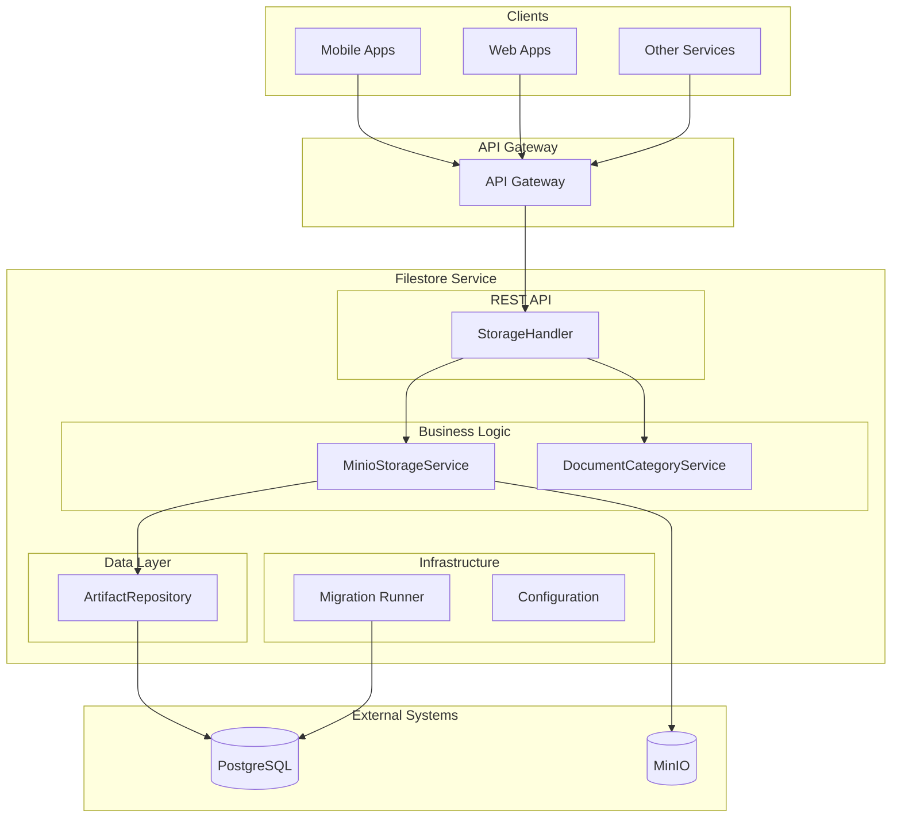

## Features

- ✅ Multipart upload with metadata persistence
- ✅ Presigned upload URL generation and upload confirmation
- ✅ File download streaming
- ✅ Retrieve signed URLs for files (thumbnail support for images)
- ✅ Document category CRUD and validation (formats, sizes, active state)
- ✅ Database migrations (checksummed runner)
- ✅ Docker-ready

## Installation & Setup

### Local Development (Manual Setup)

**Steps:**
1. Clone and setup
   ```bash
   git clone https://github.com/digitnxt/digit3.git
   cd code/services/filestore
   go mod download
   ```
2. Configure environment
   ```bash
   export DB_HOST=localhost
   export DB_PASSWORD=postgres
   export MINIO_ENDPOINT=localhost:9000
   export MINIO_ACCESS_KEY=minio
   export MINIO_SECRET_KEY=minio123
   export MINIO_BUCKET=files-write
   export MINIO_READ_BUCKET=files-read
   ```

### Docker


**Run with environment variables:**
```bash
docker run -p 8080:8080 \
  -e DB_HOST=your-db-host \
  -e DB_PASSWORD=your-db-password \
  -e MINIO_ENDPOINT=your-minio:9000 \
  -e MINIO_ACCESS_KEY=your-access \
  -e MINIO_SECRET_KEY=your-secret \
  -e MINIO_BUCKET=files-write \
  -e MINIO_READ_BUCKET=files-read \
  filestore:latest
```

## Configuration

### Environment Variables

| Variable | Description | Default | Required |
|----------|-------------|---------|----------|
| `DB_HOST` | PostgreSQL host | `minio.default` | Yes |
| `DB_PORT` | PostgreSQL port | `5432` | No |
| `DB_USER` | PostgreSQL user | `postgres` | No |
| `DB_PASSWORD` | PostgreSQL password | `postgres` | Yes |
| `DB_NAME` | PostgreSQL database | `postgres` | No |
| `DB_SSL_MODE` | PostgreSQL SSL mode | `disable` | No |
| `API_ROUTE_PATH` | Base path for API routes | `/filestore/v1/files` | No |
| `MINIO_ENDPOINT` | MinIO endpoint (host:port) | `` | Yes |
| `MINIO_ACCESS_KEY` | MinIO access key | `` | Yes |
| `MINIO_SECRET_KEY` | MinIO secret key | `` | Yes |
| `MINIO_BUCKET` | MinIO bucket for writes | `` | Yes |
| `MINIO_READ_BUCKET` | MinIO bucket for reads | `` | Yes |
| `MINIO_USE_SSL` | Use SSL for MinIO | `false` | No |

### Example .env file

```bash
DB_HOST=localhost
DB_PORT=5432
DB_USER=postgres
DB_PASSWORD=postgres
DB_NAME=postgres
DB_SSL_MODE=disable

API_ROUTE_PATH=/filestore/v1/files

MINIO_ENDPOINT=localhost:9000
MINIO_ACCESS_KEY=minio
MINIO_SECRET_KEY=minio123
MINIO_BUCKET=files-write
MINIO_READ_BUCKET=files-read
MINIO_USE_SSL=false
```

## API Reference

Base path is `API_ROUTE_PATH` (default `/filestore/v1/files`). Health endpoint: `GET /filestore/health`.

### 1) Upload Files (multipart)
- Endpoint: `POST /{ctx}/upload`
- Form Fields: `file` (one or more), `tenantId`, `module`, `tag`, `requestInfo`
- Description: Validates files against document categories and stores them in MinIO and Postgres
- Responses: `201 Created`, `400 Bad Request`, `500 Internal Server Error`

**Sequence Diagram:**
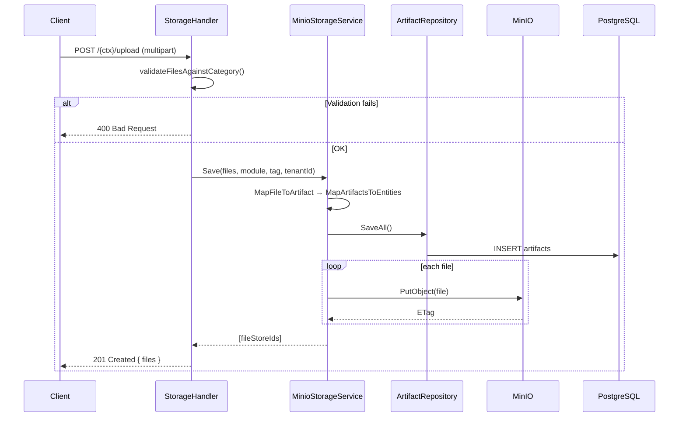

### 2) Download File (stream)
- Endpoint: `GET /{ctx}/:fileStoreId?tenantId=`
- Description: Streams the file contents with download headers
- Responses: `200 OK` (stream), `500 Internal Server Error`

**Sequence Diagram:**
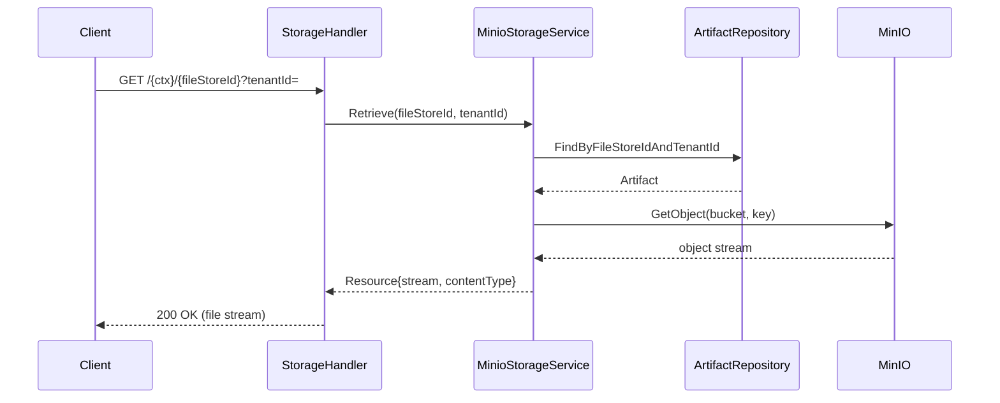

### 3) Get Metadata
- Endpoint: `POST /{ctx}/metadata`
- Body: `{ "tenantId": "...", "fileStoreId": "..." }`
- Description: Returns artifact details without file content
- Responses: `200 OK`, `500 Internal Server Error`

**Sequence Diagram:**
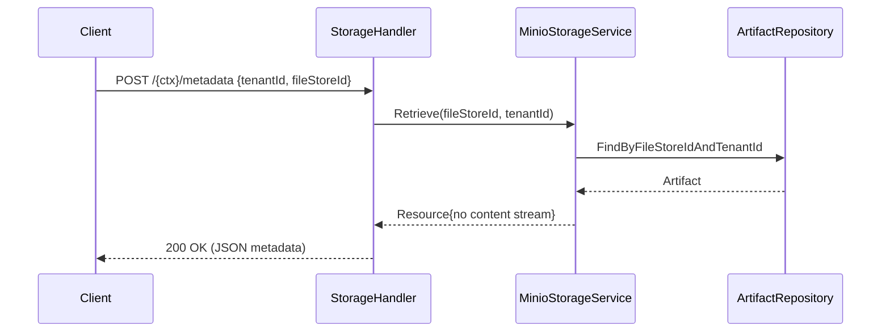

### 4) Get URLs by Tag
- Endpoint: `POST /{ctx}/tag`
- Body: `{ "tenantId": "...", "tag": "..." }`
- Description: Returns file info list for the given tag
- Responses: `200 OK`

**Sequence Diagram:**
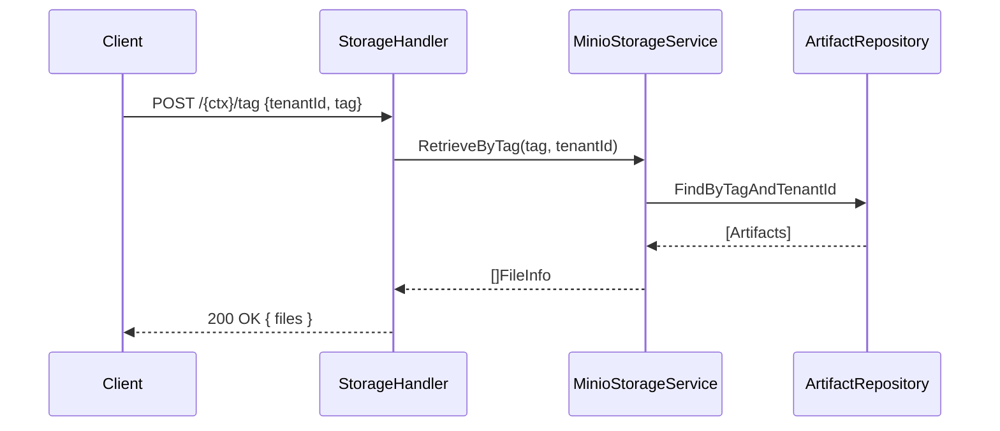

### 5) Get Download URLs
- Endpoint: `GET /{ctx}/download-urls?tenantId=...&fileStoreIds=a,b,c`
- Description: Returns a map of fileStoreId to signed URL; images may return a thumbnail URL
- Responses: `200 OK`

**Sequence Diagram:**
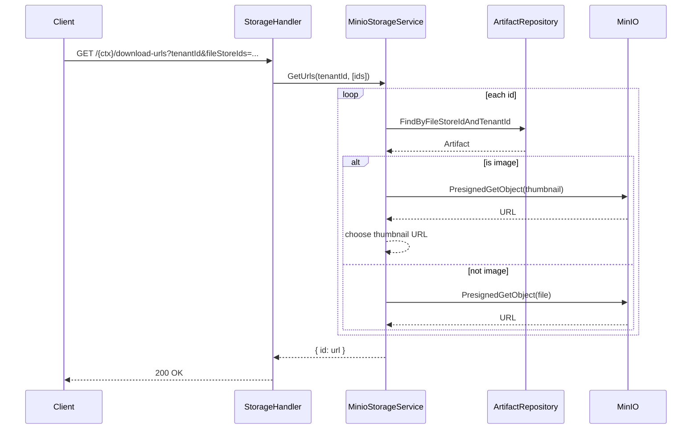

### 6) Presigned Upload URL
- Endpoint: `POST /{ctx}/upload-url`
- Headers: `X-Tenant-ID`
- Body:
```json
{
  "fileName": "document.pdf",
  "contentType": "application/pdf",
  "module": "PT",
  "tag": "receipt"
}
```
- Success `200 OK`:
```json
{
  "preSignedURL": "https://minio/put...",
  "fileStoreId": "<uuid>"
}
```
- Description: Creates an artifact record and returns a presigned URL for client-side upload

**Sequence Diagram:**
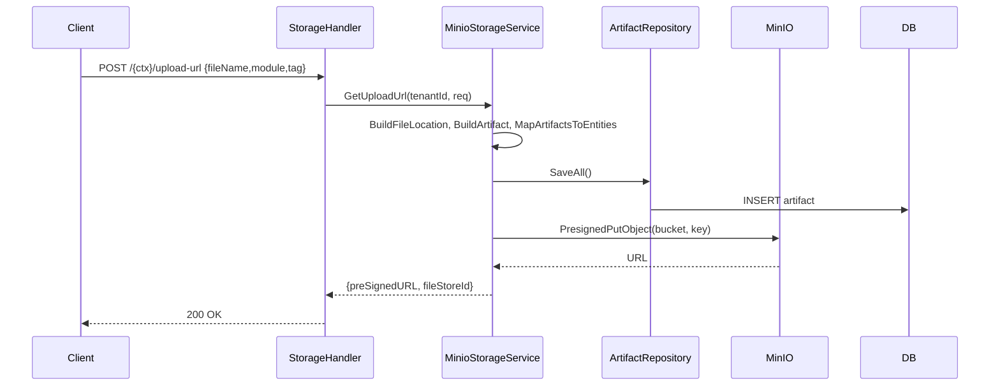

### 7) Confirm Upload
- Endpoint: `POST /{ctx}/confirm-upload`
- Headers: `X-Tenant-ID`
- Body:
```json
{ "fileStoreId": "<uuid>" }
```
- Description: Validates the uploaded object exists; updates content type; deletes artifact if invalid
- Responses: `200 OK` with `{ "status": "VALID" }` or `INVALID`, `500 Internal Server Error`

**Sequence Diagram:**
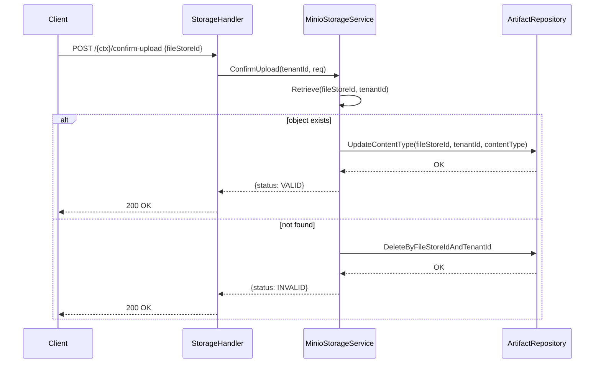

### 8) Document Categories
- Create: `POST /{ctx}/document-categories`
- List/Search: `GET /{ctx}/document-categories?type=&docCode=&isSensitive=`
- Get by Code: `GET /{ctx}/document-categories/{docCode}`
- Update: `PUT /{ctx}/document-categories/{docCode}`
- Delete: `DELETE /{ctx}/document-categories/{docCode}`

**Create - Sequence Diagram:**
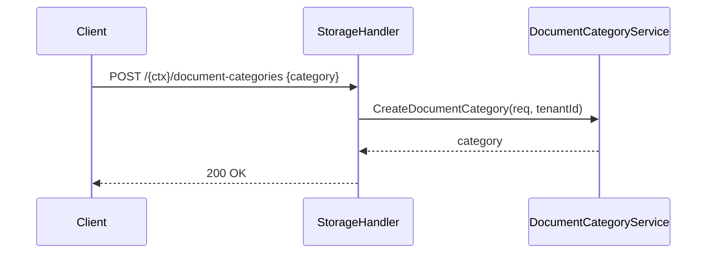

**List/Search - Sequence Diagram:**
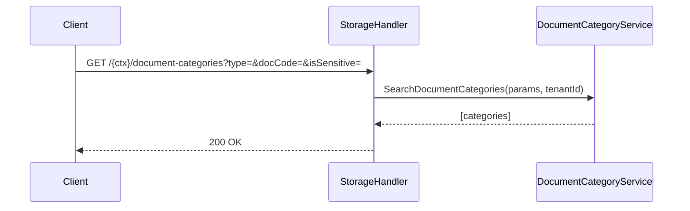

**Get by Code - Sequence Diagram:**
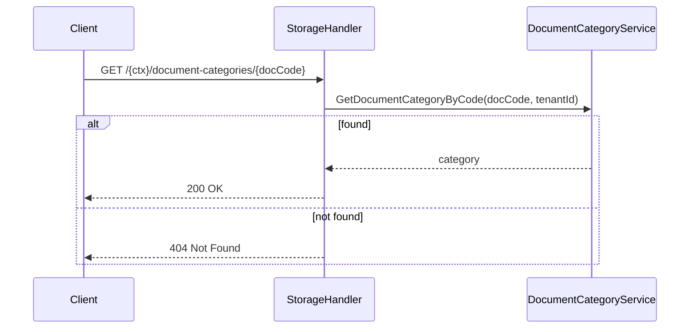

**Update - Sequence Diagram:**
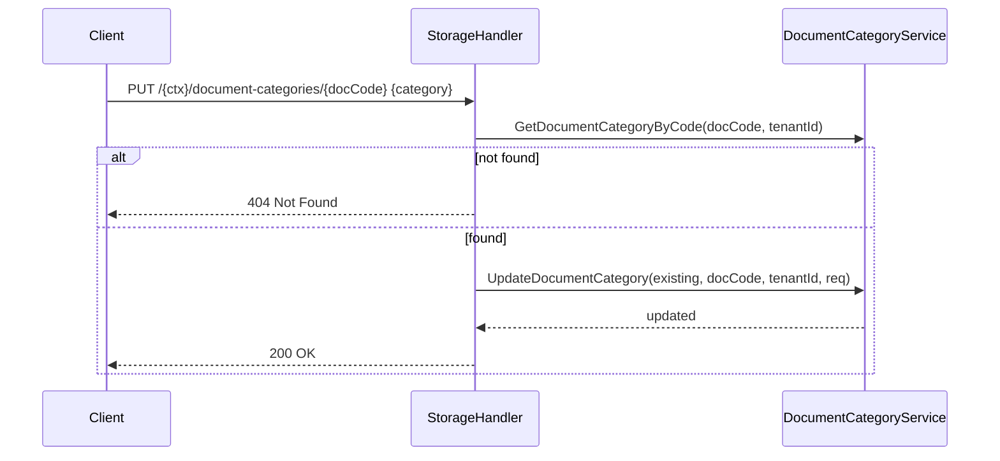

**Delete - Sequence Diagram:**
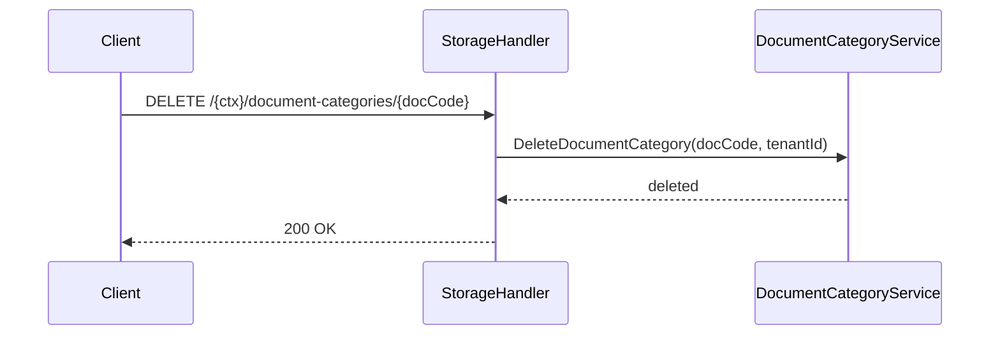

### Error Codes

| HTTP Status | Description |
|-------------|-------------|
| 400 | Invalid request parameters/body |
| 404 | Resource not found (document category) |
| 500 | Internal server error |

## Project Structure

```
filestore/
├── cmd/server/                  # Entrypoint
├── handlers/                    # HTTP handlers
├── service/                     # MinIO storage & doc category services
├── repository/                  # Postgres repository for artifacts
├── models/                      # API & DB models
├── config/                      # Env config
├── migration/                   # Migration runner
├── migrations/                  # SQL migration files
├── dockerfile                   # Docker image definition
├── go.mod / go.sum              # Go module files
└── web/, utils/                 # Response factory, helpers
```

## References

TBD

### Support Channels

TBD

---
**Last Updated:** September 2025
**Version:** 1.0.0
**Maintainer:** DIGIT Platform Team
