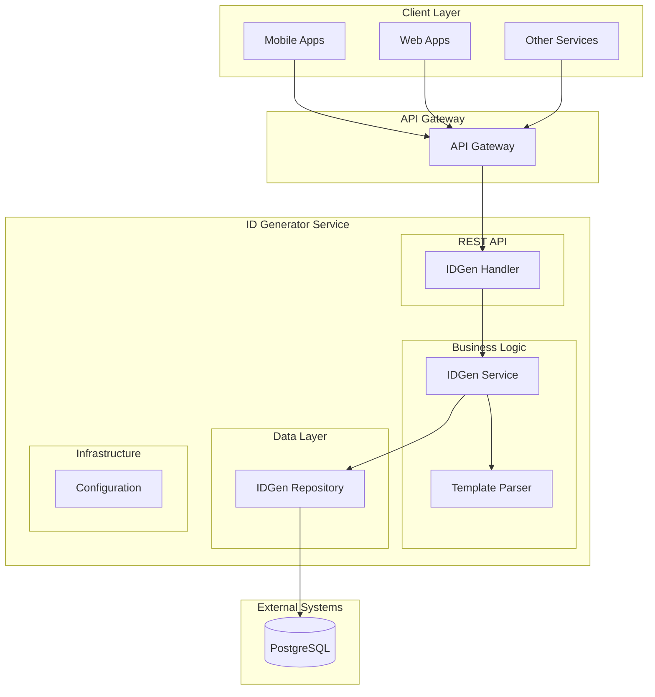
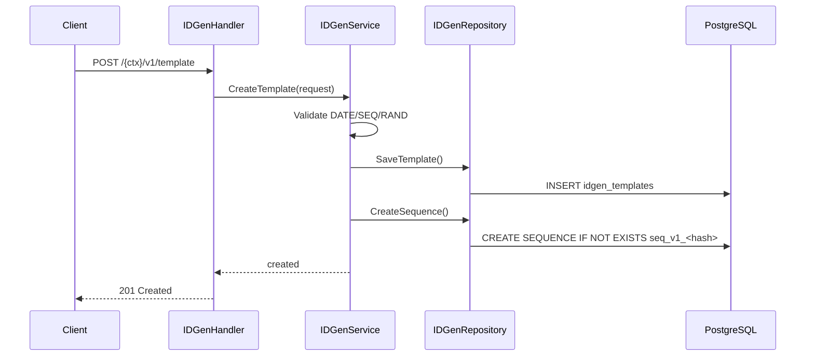
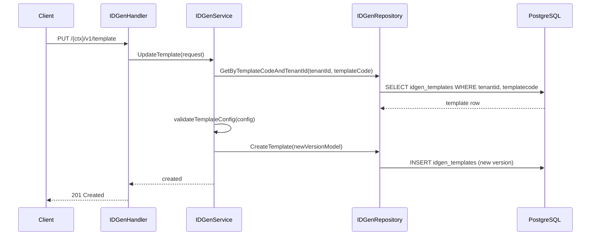
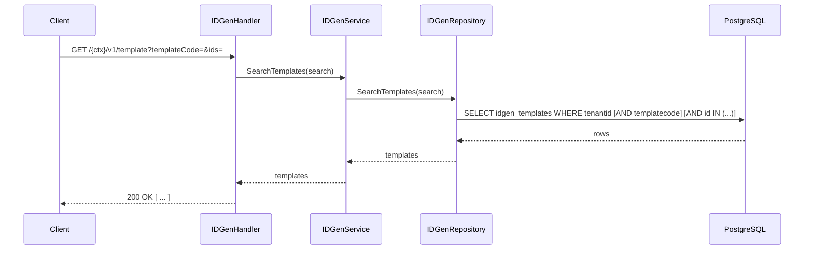
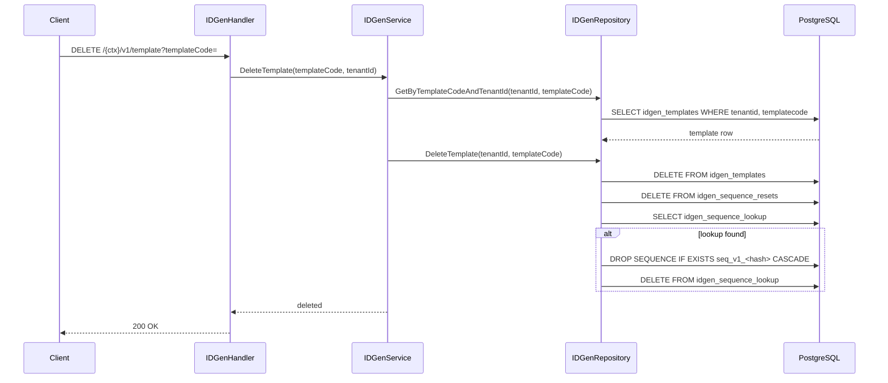
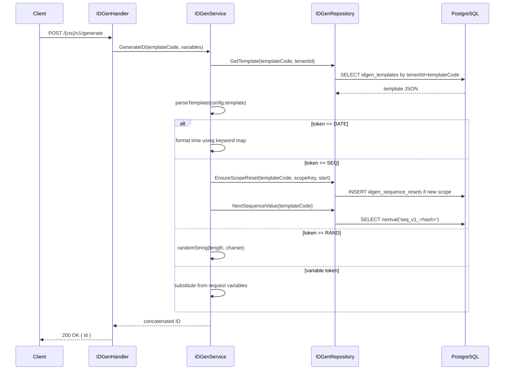

# ID Generator Service (Go)

A Go-based DIGIT microservice that generates unique, human-readable IDs from user-defined templates. It supports formatted dates, scoped and padded sequences (Postgres-backed for concurrency safety), random segments with flexible charsets, and dynamic variable substitution. Templates are registered via REST APIs, and IDs can be generated at runtime using only the template ID and input data.

## Overview

**Service Name:** idgen

**Purpose:** Provide a robust, configurable, and deterministic ID generation mechanism for DIGIT services using templates composed of literals, variables, date formats, sequences, and random segments.

**Owner/Team:** DIGIT Platform Team

## Architecture

**Tech Stack:**
- Go 1.23
- Gin Web Framework
- PostgreSQL (via GORM)
- Docker

**Core Responsibilities:**
- Register ID generation templates with JSON configuration
- Generate IDs from templates using runtime variables
- Maintain Postgres sequences per template with optional scope-based resets (daily/monthly/yearly/global)
- Validate template correctness (date formats, sequence padding, random charset)
- Maintain immutable, versioned templates (create v1, updates create v{n+1})

**Dependencies:**
- PostgreSQL 15
- Docker (for containerization)

### Diagrams

#### High-level Architecture Diagram



## Features

- ✅ Template registration with validation
- ✅ Date tokens with multiple keyword formats (e.g., `{DATE:yyyy-mm-dd}`, `{DATE:ddmmyyyy}`)
- ✅ Scoped sequences with custom padding character and length (global/daily/monthly/yearly)
- ✅ Random segment with flexible charsets and range syntax (e.g., `A-Z0-9`)
- ✅ Variable substitution for custom tokens (e.g., `{tenant}`, `{dept}`)
- ✅ Postgres-backed sequences and scope-reset tracking
- ✅ Docker containerization
- ✅ Versioned templates with immutable history and safe deletes per-version

## Configuration Schema

```json
{
  "template": "{ORG}-{DATE:yyyyMMdd}-{SEQ}-{RAND}",
  "sequence": {
    "scope": "daily",
    "start": 1,
    "padding": { "length": 4, "char": "0" }
  },
  "random": {
    "length": 2,
    "charset": "A-Z0-9"
  }
}
```

### Template
- **Type:** string
- **Value:** A pattern containing static text and dynamic tokens
- **Supported tokens:**
  - `{VARIABLE}`: any client-supplied variable (e.g., `{ORG}`, `{TENANT}`)
  - `{DATE:yyyyMMdd}`: current date formatted via keyword; see Template Syntax for full list
  - `{SEQ}`: a sequence counter, optionally scoped and padded via config
  - `{RAND}`: a random string generated from a configured charset

Example output (for `ORG=PG` on July 3, 2025):

```
PG-20250703-0001-A9
```

### Sequence
Controls behavior of the `{SEQ}` token.

| Property | Type | Description |
|----------|------|-------------|
| `scope` | string | When the counter resets: `daily`, `monthly`, `yearly`, or `global` |
| `start` | integer | Initial value when sequence is first used or after each reset |
| `padding.length` | integer | Minimum width in characters; short values are left-padded |
| `padding.char` | string | Character used for padding (e.g., `"0"` so `1` → `0001`) |

### Random
Controls behavior of the `{RAND}` token.

| Property | Type | Description |
|----------|------|-------------|
| `length` | integer | Number of characters to generate |
| `charset` | string | Allowed characters, supports ranges like `A-Z0-9` |

### Template Syntax

- **Literals:** Any text outside braces, e.g., `INV-`
- **Variables:** `{tenant}`, `{dept}` resolved from request `variables`
- **Date:** `{DATE}` or `{DATE:<keyword>}`; supported keywords include `yyyymmdd`, `ddmmyyyy`, `yyyy-mm-dd`, `dd-mm-yyyy`, `yyyy/mm/dd`, `dd/mm/yyyy`, `yyyy.mm.dd`, `dd.mm.yyyy`, `mmyyyy`, `mm-yyyy`, `yyyy-mm`, `yyyy`, `yy`, etc.
- **Sequence:** `{SEQ}`; uses Postgres sequence `seq_v1_<sha1(tenantId:templateCode)>` with left padding using `padding.char` repeated to `padding.length`
- **Random:** `{RAND}`; random string of `random.length` from `random.charset` (supports ranges like `A-Z`, `a-z`, `0-9` and combinations like `A-Za-z0-9`)

## Runtime Evaluation Flow

1. Load configuration by `templateCode` (latest version for tenant).
2. Parse the template into an ordered list of segments (static vs tokens).
3. For each segment:
   - Static → append verbatim
   - `DATE` → format `now()` using the requested keyword format
   - `SEQ` → ensure scope reset if needed, fetch `nextval` from Postgres, apply padding
   - `RAND` → pick `length` characters at random from `charset`
   - `{VARIABLE}` → substitute from the provided `variables` map
4. Concatenate all parts to produce the final ID string

## Validation & Error Handling

- Malformed date keyword → validation error when registering the template
- Padding shorter than digits in `start` → validation error when registering the template
- Unknown/empty random charset → validation error when registering the template
- Counter store (Postgres) unavailable → generation blocks/retries until recovery
- Missing required variable for a token → generation error

## Function-style Overview (mapped to REST APIs)

Although exposed as REST, the core responsibilities map cleanly to functions:

- `createTemplate(req models.IDGenTemplate): TemplateWithVersion`
  - REST: `POST /{ctx}/v1/template`
  - Stores the template config in `idgen_templates` as version `v1` and creates a backing Postgres sequence

- `updateTemplate(req models.IDGenTemplate): TemplateWithVersion`
  - REST: `PUT /{ctx}/v1/template`
  - Validates and creates a new immutable version `v{n+1}`

- `generateId(templateCode: string, variables: Map<string,string>): GenerateIDResponse`
  - REST: `POST /{ctx}/v1/generate`
  - Loads latest version, evaluates tokens, returns `{ tenantId, templateCode, version, id }`

### Storage Model and SQL Examples

Table used for template storage (matching this service's model):

```sql
CREATE TABLE IF NOT EXISTS idgen_templates (
  id                 uuid PRIMARY KEY,
  tenantid           character varying(64) NOT NULL,
  templatecode       character varying(64) NOT NULL,
  version            INTEGER NOT NULL CHECK (version > 0),
  config             jsonb NOT NULL,
  createdtime        bigint,
  createdby          character varying(64),
  lastmodifiedtime   bigint,
  lastmodifiedby     character varying(64)
);
```

Per-template Postgres sequence (created on registration):

```sql
-- Name is derived deterministically from tenantId and templateCode
CREATE SEQUENCE IF NOT EXISTS seq_v1_<sha1(tenantId:templateCode)>
  START WITH {start}
  INCREMENT BY 1
  MINVALUE 1
  CACHE 1;
```

Scope reset tracking (used to ensure sequence reset at boundaries like daily/monthly):

```sql
CREATE TABLE IF NOT EXISTS idgen_sequence_resets (
  id           uuid PRIMARY KEY,
  tenantid     character varying(64) NOT NULL,
  templatecode character varying(64) NOT NULL,
  scopekey     character varying(32) NOT NULL,
  lastvalue    bigint NOT NULL DEFAULT 0
);
```

Sequence name lookup (used for safe drops on delete):

```sql
CREATE TABLE IF NOT EXISTS idgen_sequence_lookup (
  id           uuid PRIMARY KEY,
  seqname      character varying(128) NOT NULL,
  tenantid     character varying(64) NOT NULL,
  templatecode character varying(64) NOT NULL
);
```

Notes:
- Padding is configured via JSON (`sequence.padding`) rather than inline tokens.
- Date formatting uses predefined keywords; see Template Syntax for supported values.

## Installation & Setup

### Local Development (Manual Setup)

**Prerequisites:**
- Go 1.23+
- PostgreSQL 15

**Steps:**
1. Clone and setup
   ```bash
   git clone https://github.com/digitnxt/digit3.git
   cd code/services/idgen
   go mod download
   ```
2. Setup PostgreSQL database
   ```bash
   createdb idgen_db
   ```
3. Start service
   ```bash
   go run ./cmd/server
   ```

### Docker

**Build the image:**
```bash
docker build -t idgen:latest .
```

**Run with environment variables:**
```bash
docker run -p 8080:8080 \
  -e DB_HOST=your-db-host \
  -e DB_PASSWORD=your-db-password \
  idgen:latest
```

Migrations are not auto-executed by the service. Run SQL migrations manually via Flyway using the configs in `db/config/` and scripts in `db/` before starting the service.

## Configuration

### Environment Variables

| Variable | Description | Default | Required |
|----------|-------------|---------|----------|
| `HTTP_PORT` | Port for REST API server | `8080` | No |
| `SERVER_CONTEXT_PATH` | Base path for API routes | `/idgen` | No |
| `DB_HOST` | PostgreSQL host | `localhost` | Yes |
| `DB_PORT` | PostgreSQL port | `5432` | No |
| `DB_USER` | PostgreSQL username | `postgres` | No |
| `DB_PASSWORD` | PostgreSQL password | `postgres` | Yes |
| `DB_NAME` | PostgreSQL database | `idgen_db` | No |
| `DB_SSL_MODE` | PostgreSQL SSL mode | `disable` | No |
| `MIGRATION_SCRIPT_PATH` | Path to SQL migrations | `./db/migrations` | No |

### Example .env file

```bash
HTTP_PORT=8080
SERVER_CONTEXT_PATH=/idgen

DB_HOST=localhost
DB_PORT=5432
DB_USER=postgres
DB_PASSWORD=secure_password
DB_NAME=idgen_db
DB_SSL_MODE=disable

MIGRATION_SCRIPT_PATH=./db/migrations
```

## API Reference

Base path is `SERVER_CONTEXT_PATH` (default `/idgen`). All routes are under `v1`.

Required headers for all endpoints unless stated otherwise:

- `X-Tenant-ID`: Tenant identifier (required)
- `X-Client-ID`: Caller identifier (optional; used for audit fields)

### Templates

#### 1) Create Template
- Endpoint: `POST /{ctx}/v1/template`
- Headers: `X-Tenant-ID` (required), `X-Client-ID` (optional)
- Description: Registers a new ID generation template with configuration and initializes its sequence
- Request Body (fields as per handler/models):
```json
{
  "templateCode": "receipt-id",
  "config": {
    "template": "{tenant}-{DATE:yyyy-mm-dd}-{SEQ}-{RAND}",
    "sequence": {
      "scope": "daily",
      "start": 1,
      "padding": { "length": 6, "char": "0" }
    },
    "random": { "length": 4, "charset": "A-Z0-9" }
  }
}
```
- Responses: `201 Created`, `400 Bad Request`, `409 Conflict`, `500 Internal Server Error`

**Sequence Diagram:**


#### 2) Update Template
- Endpoint: `PUT /{ctx}/v1/template`
- Headers: `X-Tenant-ID` (required), `X-Client-ID` (optional)
- Description: Creates a new immutable version of an existing template's configuration (increments version)
- Request Body: same shape as Register Template
- Responses: `201 Created`, `400 Bad Request`, `404 Not Found`, `500 Internal Server Error`

**Sequence Diagram:**


#### 3) Search Templates
- Endpoint: `GET /{ctx}/v1/template`
- Headers: `X-Tenant-ID` (required)
- Query Params:
  - `templateCode` (optional)
  - `ids` (optional, comma-separated list of UUIDs)
  - `version` (optional, format `v<number>`). When provided, `templateCode` is required.
- Responses: `200 OK` (array of templates), `500 Internal Server Error`

Notes:
- If only `tenantId` is provided (no `templateCode`, no `ids`, no `version`), the latest version of each template is returned.
- If `templateCode` is provided without `version`, the latest version for that template is returned.
- If `ids` are provided, those specific rows are returned; you may also include `templateCode`.
 - If `version` is provided without `templateCode`, the service returns `500` due to validation; include `templateCode` with `version`.

**Sequence Diagram:**


#### 4) Delete Template
- Endpoint: `DELETE /{ctx}/v1/template`
- Headers: `X-Tenant-ID` (required)
- Query Params:
  - `templateCode` (required)
  - `version` (required, format `v<number>`, e.g., `v1`)
- Responses: `200 OK`, `400 Bad Request`, `404 Not Found`, `500 Internal Server Error`

Deletion semantics:
- When deleting a non-latest version, only that versioned row is removed; sequence, resets, and lookup remain.
- When deleting the latest version and other versions still exist, only the latest versioned row is removed.
- When deleting the only existing version for a template, the template row, its scope reset rows, sequence lookup, and the underlying Postgres sequence are fully cleaned up.

**Sequence Diagram:**


### ID Generation

#### 5) Generate ID
- Endpoint: `POST /{ctx}/v1/generate`
- Description: Generates an ID from a registered template using optional variables
- Request Body:
```json
{
  "templateCode": "receipt-id",
  "variables": {
    "tenant": "pb",
    "dept": "REV"
  }
}
```
- Success `200 OK`:
```json
{
  "tenantId": "pb",
  "templateCode": "receipt-id",
  "version": "v3",
  "id": "pb-2025-09-22-000123-A9XZ"
}
```
- Error `400 Bad Request` or `500 Internal Server Error`

**Sequence Diagram:**


### Error Codes

| HTTP Status | Error Code | Description |
|-------------|------------|-------------|
| 400 | BAD_REQUEST | Invalid request parameters/body |
| 404 | NOT_FOUND | Template not found |
| 500 | INTERNAL_SERVER_ERROR | Server error |
| 500 | GENERATION_FAILED | Template invalid or generation failed |
| 409 | CONFLICT | Template already exists (on create) |

## Project Structure

```
idgen/
├── cmd/server/                  # Application entrypoint
├── internal/                    # Private application code
│   ├── config/                  # Env config
│   ├── db/                      # Postgres connection
│   ├── handlers/                # HTTP handlers
│   ├── migration/               # Migration runner and tracking
│   ├── models/                  # API & DB models
│   ├── repository/              # Data access layer (templates, sequences)
│   ├── routes/                  # Route definitions
│   └── service/                 # Business logic and template parser
├── db/migrations/               # SQL migration files
├── Dockerfile                   # Docker image definition
├── go.mod                       # Go module definition
└── go.sum                       # Go module checksums
```

## References

TBD

### Support Channels

TBD

---
**Last Updated:** October 2025
**Version:** 1.0.0
**Maintainer:** DIGIT Platform Team
