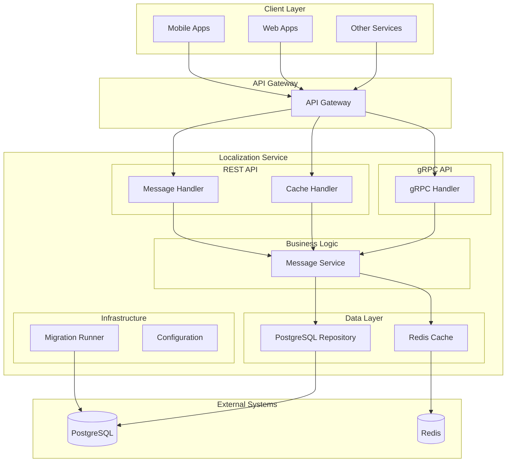
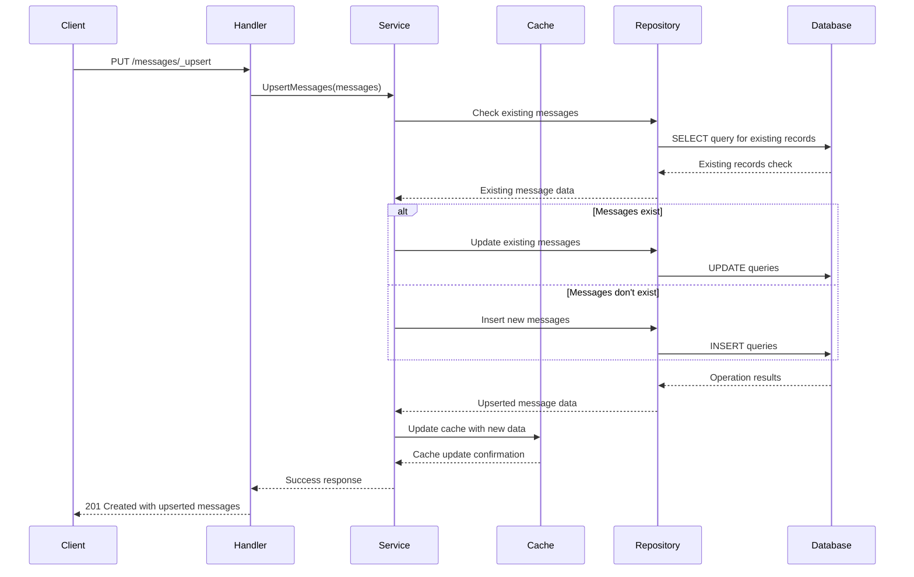
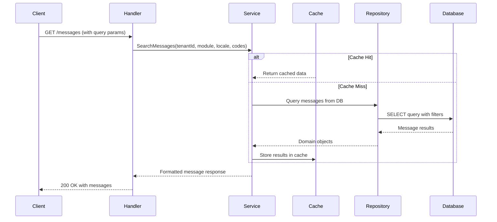
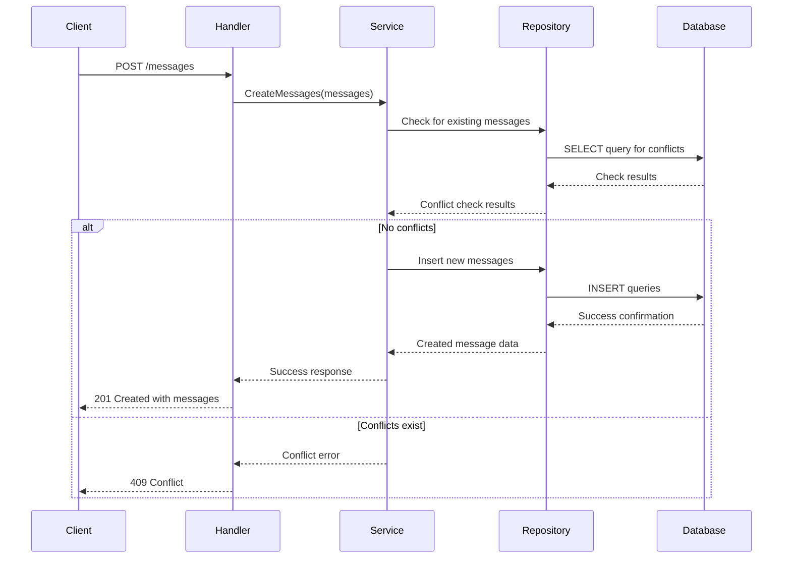
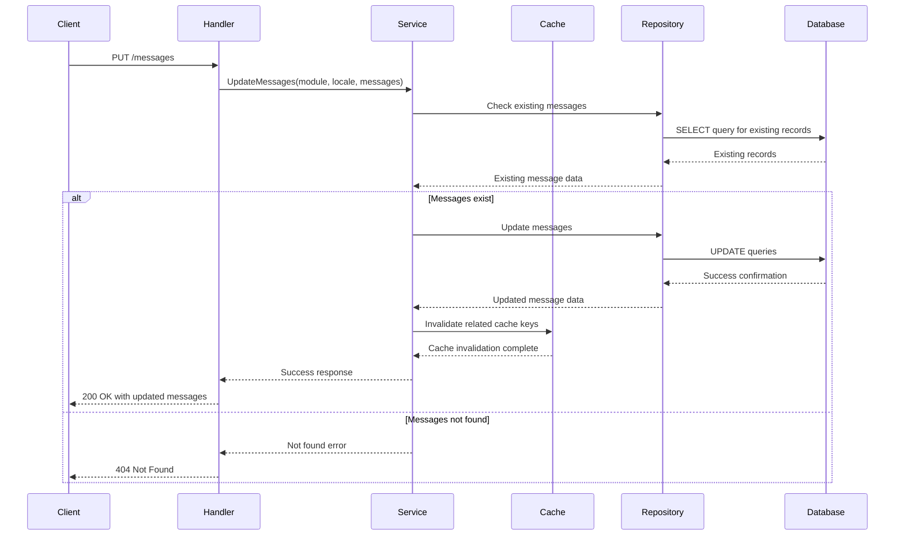
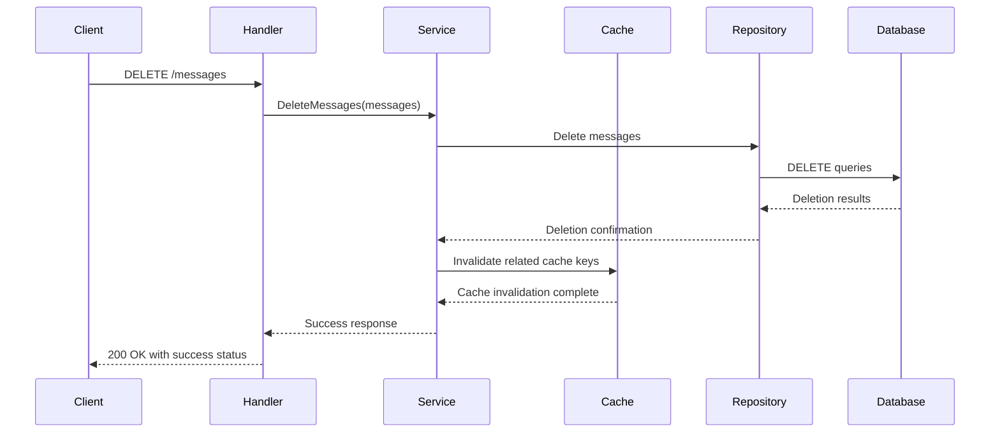
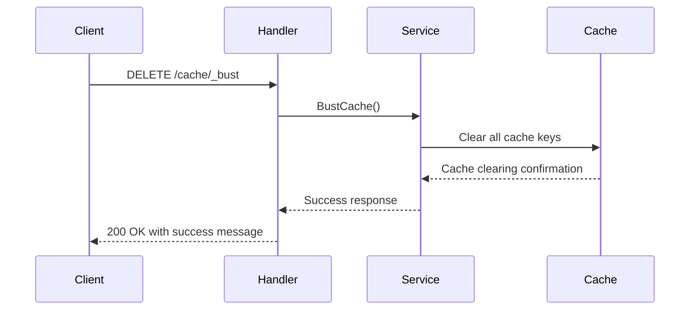
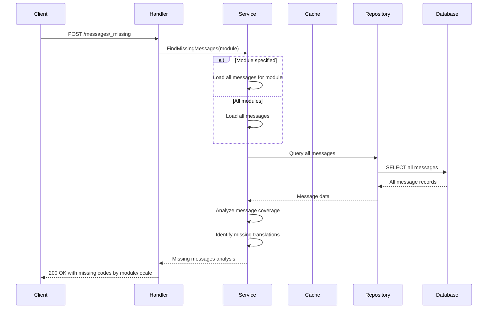

# Localization Service

A Go-based implementation of the DIGIT localization service using the Gin framework. This service provides locale-specific components and translates text for applications.


## Architecture

**Tech Stack:**
- Go 1.24+
- Gin Web Framework
- PostgreSQL
- Redis (via go-redis/v9)
- Docker

**Core Responsibilities:**
- Store and retrieve locale-specific messages with key-value pairs
- Multi-tenant support for different organizations
- Multi-language support with locale-specific content
- Efficient caching with Redis for performance
- PostgreSQL persistence with optimized queries
- REST and gRPC API interfaces
- Missing message API

**Dependencies:**
- PostgreSQL 15
- Redis 6+ for caching(optional)

### Diagrams

#### High-level Architecture Diagram



## Features

- ✅ Store and retrieve locale-specific messages with key-value pairs
- ✅ Multi-tenant support with tenant isolation
- ✅ Multi-language support with locale-specific content
- ✅ Efficient Redis caching for high performance
- ✅ PostgreSQL database for persistent storage
- ✅ Clean architecture with separation of concerns
- ✅ REST API with JSON responses
- ✅ gRPC API for high-performance service communication
- ✅ Database migrations with rollback support
- ✅ Cache busting functionality
- ✅ Missing message detection feature
- ✅ Docker containerization
- ✅ Comprehensive test coverage

## Installation & Setup

### Local Development (Manual Setup)

**Steps:**

1. Clone and setup
   ```bash
   git clone https://github.com/yourusername/localization.git
   cd localization
   go mod download
   ```

2. Setup PostgreSQL database
   ```bash
   createdb localization
   ```

3. Setup Redis
   ```bash
   redis-server
   ```

4. Start service
   ```bash
   go run ./cmd/server
   ```

### Docker


**Run migrations first:**
```bash
docker run --rm \
  -e DB_HOST=your-db-host \
  -e DB_PORT=5432 \
  -e DB_USER=your-db-user \
  -e DB_PASSWORD=your-db-password \
  -e DB_NAME=your-db-name \
  localization-migrator:latest
```

**Then run the main service:**
```bash
docker run -p 8080:8080 \
  -e DB_HOST=your-db-host \
  -e DB_PASSWORD=your-db-password \
  -e REDIS_HOST=your-redis-host \
  localization:latest
```

## Configuration

### Environment Variables

| Variable | Description | Default Value | Required |
|----------|-------------|---------------|----------|
| `REST_PORT` | Port for REST API server | `8080` | No |
| `GRPC_PORT` | Port for gRPC API server | `8089` | No |
| `DB_HOST` | PostgreSQL database host | `localhost` | Yes |
| `DB_PORT` | PostgreSQL database port | `5432` | No |
| `DB_USER` | PostgreSQL database username | `postgres` | No |
| `DB_PASSWORD` | PostgreSQL database password | `postgres` | Yes |
| `DB_NAME` | PostgreSQL database name | `postgres` | No |
| `DB_SSL_MODE` | PostgreSQL SSL mode | `disable` | No |
| `REDIS_HOST` | Redis server host | `localhost` | Yes |
| `REDIS_PORT` | Redis server port | `6379` | No |
| `REDIS_PASSWORD` | Redis server password | `(empty)` | No |
| `REDIS_DB` | Redis database index | `0` | No |
| `CACHE_EXPIRATION` | Cache expiration duration | `24h` | No |
| `CACHE_TYPE` | Cache type (redis/in-memory) | `redis` | No |

### Example .env file

```bash
# Server Configuration
REST_PORT=8080
GRPC_PORT=8089

# Database Configuration
DB_HOST=localhost
DB_PORT=5432
DB_USER=postgres
DB_PASSWORD=secure_password
DB_NAME=localization
DB_SSL_MODE=disable

# Redis Configuration
REDIS_HOST=localhost
REDIS_PORT=6379
REDIS_PASSWORD=
REDIS_DB=0

# Cache Configuration
CACHE_EXPIRATION=24h
CACHE_TYPE=redis
```

## API Reference

### REST API Endpoints

#### 1. Upsert Messages
- **Endpoint**: `PUT /localization/messages/_upsert`
- **Description**: Creates or updates localization messages
- **Headers**: `X-Tenant-ID: {tenantId}`
- **Request Body**:
```json
{
  "messages": [
    {
      "code": "welcome.message",
      "message": "Welcome to our application",
      "module": "auth",
      "locale": "en_US"
    }
  ]
}
```
- **Response**: `201 Created` with created/updated messages

**Sequence Diagram:**



#### 2. Search Messages
- **Endpoint**: `GET /localization/messages`
- **Description**: Searches for localization messages
- **Query Parameters**:
  - `tenantId` (required)
  - `module` (optional)
  - `locale` (optional)
  - `codes` (optional, comma-separated)
  - `limit` (optional, default: 20)
  - `offset` (optional, default: 0)
- **Response**: `200 OK` with matching messages

**Sequence Diagram:**




#### 3. Create Messages
- **Endpoint**: `POST /localization/messages`
- **Description**: Creates new localization messages (fails if exists)
- **Headers**: `X-Tenant-ID: {tenantId}`
- **Request Body**: Same as upsert
- **Response**: `201 Created` with created messages

**Sequence Diagram:**




#### 4. Update Messages
- **Endpoint**: `PUT /localization/messages`
- **Description**: Updates existing localization messages
- **Headers**: `X-Tenant-ID: {tenantId}`
- **Request Body**:
```json
{
  "module": "auth",
  "locale": "en_US",
  "messages": [
    {
      "code": "welcome.message",
      "message": "Updated welcome message"
    }
  ]
}
```
- **Response**: `200 OK` with updated messages

**Sequence Diagram:**




#### 5. Delete Messages
- **Endpoint**: `DELETE /localization/messages`
- **Description**: Deletes localization messages
- **Headers**: `X-Tenant-ID: {tenantId}`
- **Request Body**:
```json
{
  "messages": [
    {
      "module": "auth",
      "locale": "en_US",
      "code": "welcome.message"
    }
  ]
}
```
- **Response**: `200 OK` with success status

**Sequence Diagram:**




**Sequence Diagram:**



#### 6. Cache Bust
- **Endpoint**: `DELETE /localization/cache/_bust`
- **Description**: Clears the entire message cache
- **Response**: `200 OK` with success message

#### 7. Find Missing Messages
- **Endpoint**: `POST /localization/messages/_missing`
- **Description**: Finds missing localization messages
- **Headers**: `X-Tenant-ID: {tenantId}`
- **Request Body**:
```json
{
  "module": "auth"
}
```
- **Response**: `200 OK` with missing message codes by module/locale

**Sequence Diagram:**




### gRPC API

The service also provides a gRPC API with identical functionality. The protobuf definition can be found in `api/proto/localization/v1/localization.proto`.

### Error Codes

| HTTP Status | Error Code | Description |
|-------------|------------|-----------|
| 400 | BAD_REQUEST | Invalid request parameters |
| 401 | UNAUTHORIZED | Authentication required |
| 403 | FORBIDDEN | Insufficient permissions |
| 404 | NOT_FOUND | Resource not found |
| 409 | CONFLICT | Resource already exists |
| 422 | UNPROCESSABLE_ENTITY | Validation failed |
| 500 | INTERNAL_SERVER_ERROR | Server error |


# Docker (migration container)
docker run --rm \
  -e DB_HOST=localhost \
  -e DB_PASSWORD=your-password \
  localization-migrator:latest

# Kubernetes (init container)
# Migrations run automatically before service starts
```

### Cache Operations

#### Cache Bursting
```bash
curl -X DELETE http://localhost:8080/localization/messages/cache-bust
```


### Project Structure

```
localization/
├── api/proto/                    # Protocol buffer definitions
├── cmd/server/                   # Application entrypoint
├── configs/                      # Configuration management
├── db/                          # Database migration files
│   ├── migrations/             # SQL migration files (Flyway)
│   ├── config/                 # Flyway configuration files
│   └── tools/                  # Migration tools (auto-downloaded)
├── internal/                     # Private application code
│   ├── cache/                   # Cache implementations
│   ├── common/                  # Shared utilities
│   ├── core/                    # Business logic
│   │   ├── domain/             # Domain models
│   │   ├── ports/              # Interfaces
│   │   └── services/           # Business logic
│   ├── handlers/               # HTTP/gRPC handlers
│   ├── platform/               # Platform-specific code
│   └── repositories/           # Data access layer
├── pkg/dtos/                    # Data transfer objects
├── scripts/                     # Build/utility scripts
└── tests/                       # Integration tests
```


**Last Updated:** September 2025
**Version:** 1.0.0
