# Workflow Service 

A Go-based implementation of the DIGIT workflow service using the Gin framework. This service provides stateful workflow management, process definitions, and automated state transitions for applications.


## Architecture

**Tech Stack:**
- Go 1.24+
- Gin Web Framework
- PostgreSQL

**Core Responsibilities:**
- Define and manage workflow processes with states and actions
- Track process instances as they move through workflow states
- Enforce business rules and guard conditions at state transitions
- Support parallel workflow execution with branch coordination
- Provide auto-escalation capabilities based on SLA breaches
- Multi-tenant support for different organizations
- REST API interface for workflow operations

**Dependencies:**
- PostgreSQL 15

### Diagrams

#### High-level Architecture Diagram

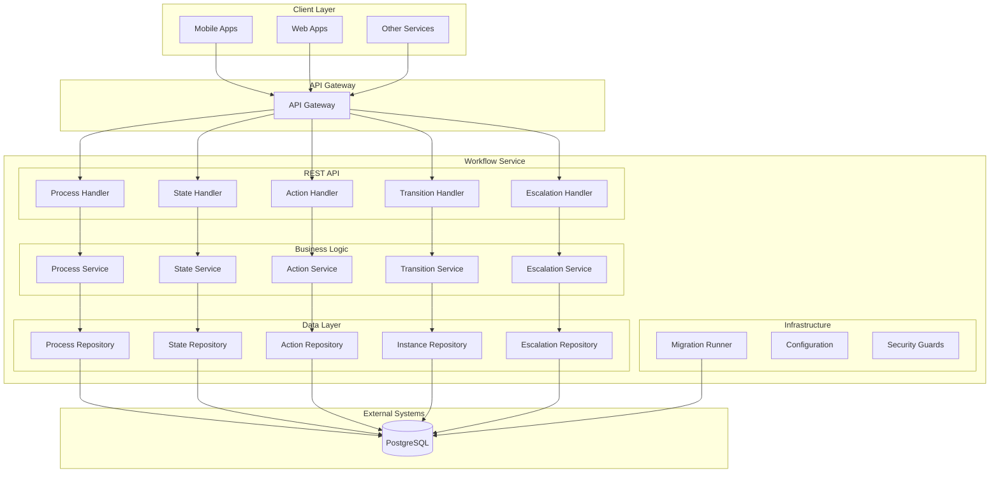

## Features

- ✅ Define and manage workflow processes with states and actions
- ✅ Multi-tenant support with tenant isolation
- ✅ Stateful process instance tracking
- ✅ Guard condition enforcement (attribute validation, assignee checks)
- ✅ Parallel workflow execution with branch coordination
- ✅ Auto-escalation based on SLA breaches
- ✅ Clean architecture with separation of concerns
- ✅ REST API with JSON responses
- ✅ Database migrations with rollback support
- ✅ Comprehensive audit trail
- ✅ Docker containerization
- ✅ Multi-step process orchestration

## Installation & Setup

### Local Development (Manual Setup)

**Steps:**

1. Clone and setup
   ```bash
   git clone https://github.com/yourusername/workflow.git
   cd workflow
   go mod download
   ```

2. Setup PostgreSQL database
   ```bash
   createdb workflow
   ```
3. Start service
   ```bash
   go run ./cmd/server
   ```

### Docker Production Setup


**Run with environment variables:**
```bash
docker run -p 8080:8080 \
  -e DB_HOST=your-db-host \
  -e DB_PASSWORD=your-db-password \
  workflow-go:latest
```

## Configuration

### Environment Variables

| Variable | Description | Default Value | Required |
|----------|-------------|---------------|----------|
| `SERVER_PORT` | Port for REST API server | `8080` | No |
| `DB_HOST` | PostgreSQL database host | `localhost` | Yes |
| `DB_PORT` | PostgreSQL database port | `5432` | No |
| `DB_USER` | PostgreSQL database username | `postgres` | No |
| `DB_PASSWORD` | PostgreSQL database password | `postgres` | Yes |
| `DB_NAME` | PostgreSQL database name | `postgres` | No |
| `RUN_MIGRATIONS` | Whether to run migrations on startup | `true` | No |
| `MIGRATION_PATH` | Path to migration files | `db/migration` | No |
| `MIGRATION_TIMEOUT` | Migration timeout duration | `5m` | No |

### Example .env file

```bash
# Server Configuration
SERVER_PORT=8080

# Database Configuration
DB_HOST=localhost
DB_PORT=5432
DB_USER=postgres
DB_PASSWORD=secure_password
DB_NAME=workflow

# Migration Configuration
RUN_MIGRATIONS=true
MIGRATION_PATH=db/migration
MIGRATION_TIMEOUT=5m
```

## API Reference

### REST API Endpoints

#### 1. Create Process
- **Endpoint**: `POST /workflow/v1/process`
- **Description**: Creates a new workflow process definition
- **Headers**: `X-Tenant-ID: {tenantId}`
- **Request Body**:
```json
{
  "name": "Application Review Process",
  "code": "APP_REVIEW",
  "description": "Process for reviewing applications",
  "version": "1.0",
  "sla": 1440
}
```
- **Response**: `201 Created` with created process

**Sequence Diagram:**

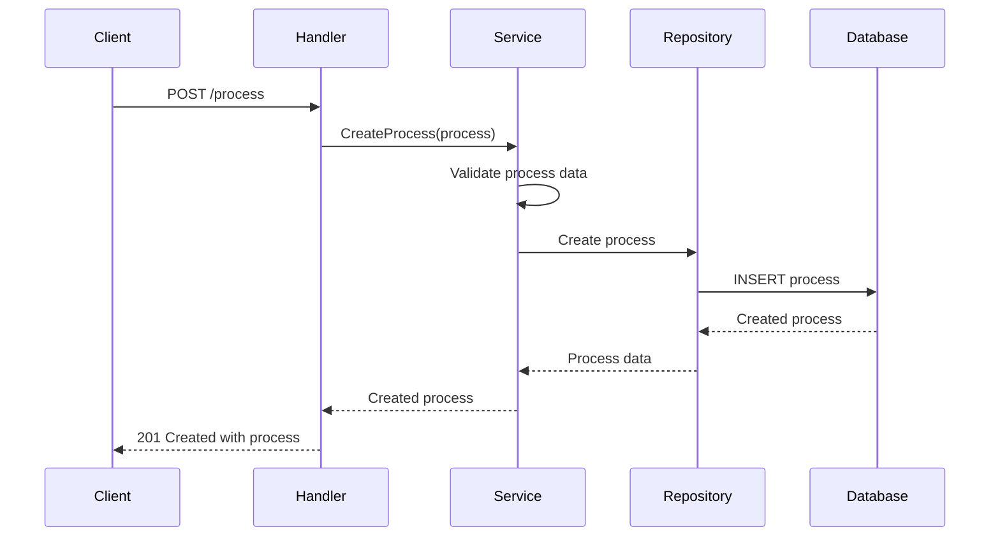

#### 2. Get Process Definitions
- **Endpoint**: `GET /workflow/v1/process/definition`
- **Description**: Retrieves process definitions with states and actions
- **Query Parameters**:
  - `id` (optional, array)
  - `name` (optional, array)
  - `code` (optional, array)
- **Response**: `200 OK` with process definitions

**Sequence Diagram:**

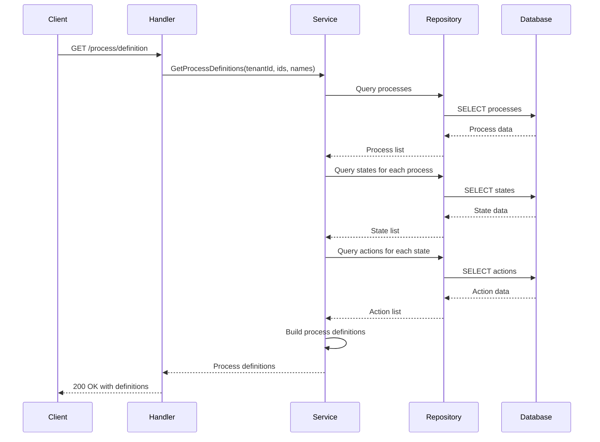

#### 3. Create State
- **Endpoint**: `POST /workflow/v1/process/{processId}/state`
- **Description**: Creates a new state within a process
- **Headers**: `X-Tenant-ID: {tenantId}`
- **Request Body**:
```json
{
  "code": "SUBMITTED",
  "name": "Application Submitted",
  "description": "Application has been submitted for review",
  "processId": "process-uuid",
  "sla": 60,
  "isInitial": true
}
```
- **Response**: `201 Created` with created state

**Sequence Diagram:**

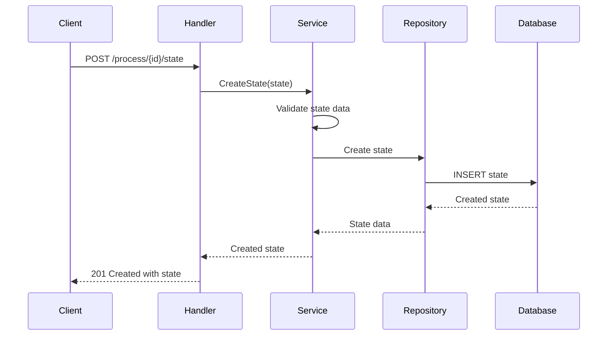

#### 4. Create Action
- **Endpoint**: `POST /workflow/v1/state/{stateId}/action`
- **Description**: Creates a new action/transition between states
- **Headers**: `X-Tenant-ID: {tenantId}`
- **Request Body**:
```json
{
  "name": "APPROVE",
  "label": "Approve Application",
  "currentState": "state-uuid-1",
  "nextState": "state-uuid-2",
  "attributeValidation": {
    "attributes": {
      "role": ["REVIEWER", "ADMIN"],
      "department": ["IT", "HR"]
    },
    "assigneeCheck": true
  }
}
```
- **Response**: `201 Created` with created action

**Sequence Diagram:**

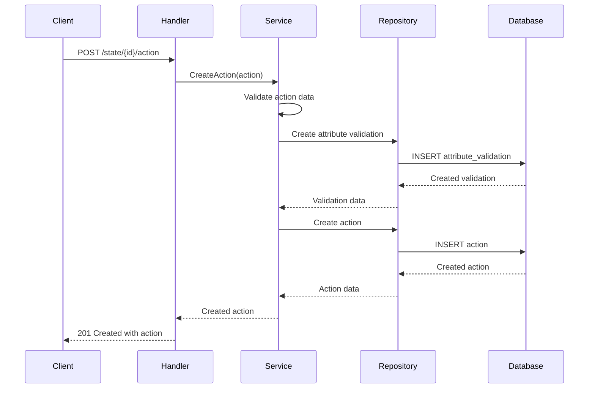

#### 5. Process Transition
- **Endpoint**: `POST /workflow/v1/transition`
- **Description**: Transitions a process instance to the next state
- **Headers**: `X-Tenant-ID: {tenantId}`
- **Request Body**:
```json
{
  "processId": "process-uuid",
  "entityId": "application-123",
  "action": "APPROVE",
  "comment": "Application approved by reviewer",
  "assigner": "user-123",
  "assignees": ["user-456"],
  "attributes": {
    "role": ["REVIEWER"],
    "department": ["IT"]
  }
}
```
- **Response**: `202 Accepted` with updated process instance

**Sequence Diagram:**

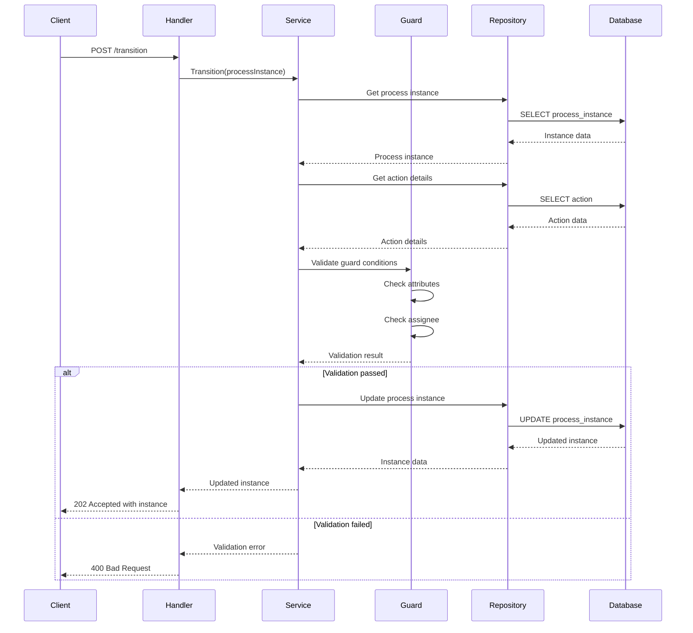

#### 6. Auto-Escalation
- **Endpoint**: `POST /workflow/v1/auto/{processCode}/_escalate`
- **Description**: Escalates process instances based on SLA breaches
- **Headers**: `X-Tenant-ID: {tenantId}`
- **Request Body**:
```json
{
  "attributes": {
    "role": ["ADMIN"],
    "department": ["IT"]
  }
}
```
- **Response**: `200 OK` with escalation results

**Sequence Diagram:**

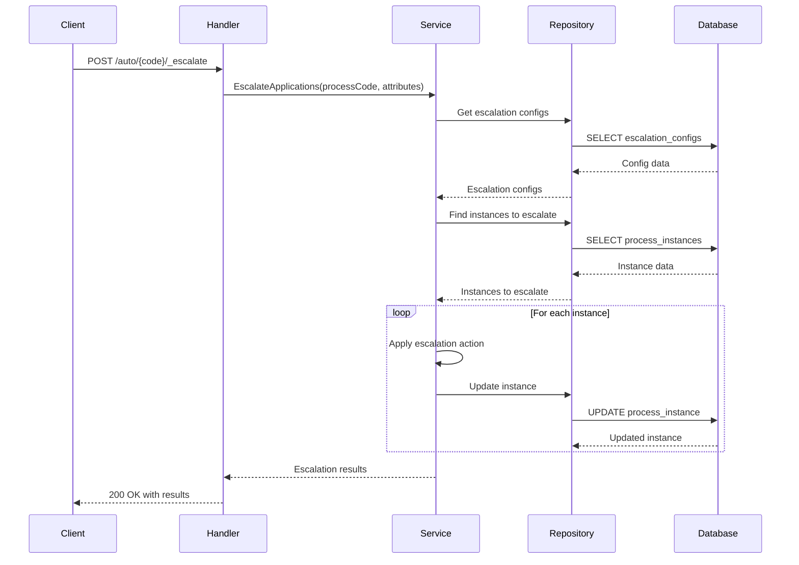

#### 7. Get Processes
- **Endpoint**: `GET /workflow/v1/process`
- **Description**: Retrieves a list of processes with optional filtering
- **Query Parameters**:
  - `id` (optional, array)
  - `name` (optional, array)
- **Response**: `200 OK` with list of processes

**Sequence Diagram:**

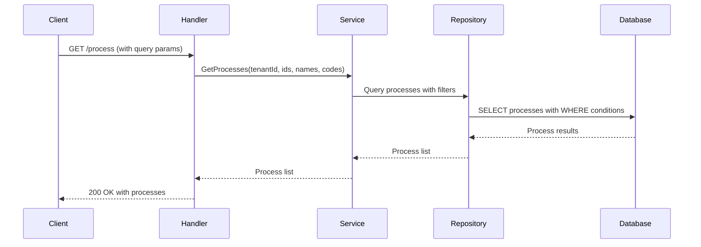

#### 8. Get Process by ID
- **Endpoint**: `GET /workflow/v1/process/{id}`
- **Description**: Retrieves a specific process by its ID
- **Response**: `200 OK` with process details

**Sequence Diagram:**

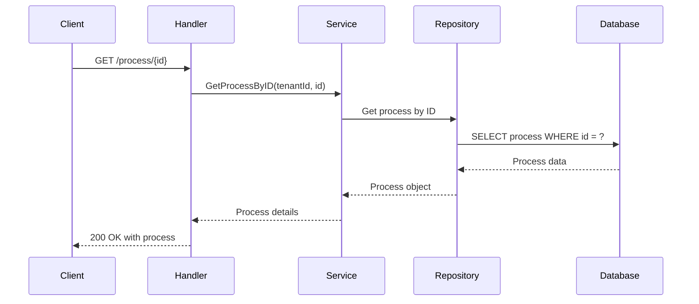

#### 9. Update Process
- **Endpoint**: `PUT /workflow/v1/process/{id}`
- **Description**: Updates an existing process
- **Headers**: `X-Tenant-ID: {tenantId}`
- **Request Body**: Process object with updated fields
- **Response**: `200 OK` with updated process

**Sequence Diagram:**

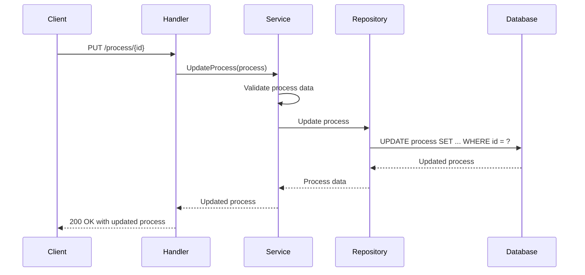

#### 10. Delete Process
- **Endpoint**: `DELETE /workflow/v1/process/{id}`
- **Description**: Deletes a process and its associated states/actions
- **Response**: `204 No Content`

**Sequence Diagram:**

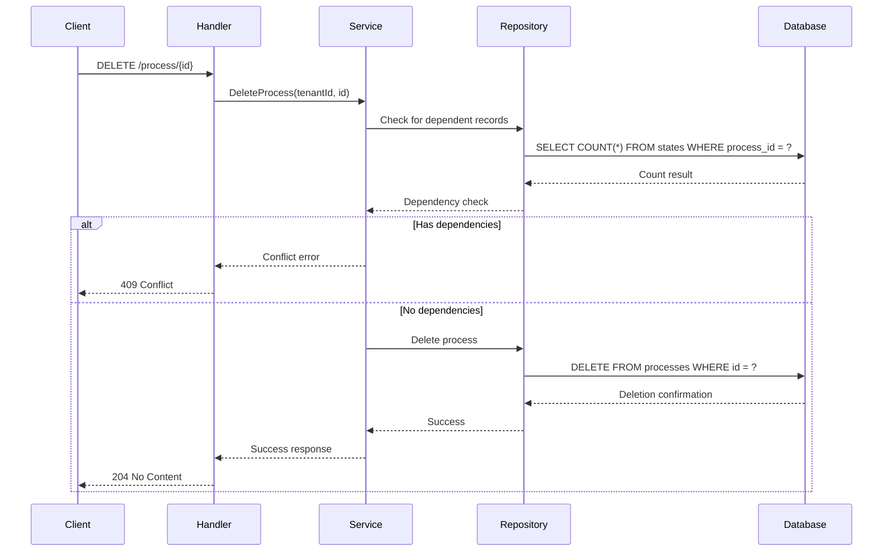

#### 11. Get States
- **Endpoint**: `GET /workflow/v1/process/{processId}/state`
- **Description**: Retrieves all states for a specific process
- **Query Parameters**:
  - `code` (optional, array)
- **Response**: `200 OK` with list of states

**Sequence Diagram:**

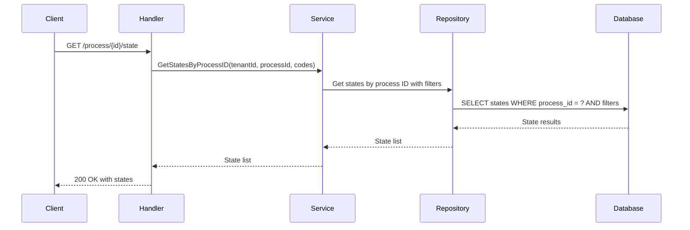

#### 12. Get State by ID
- **Endpoint**: `GET /workflow/v1/state/{id}`
- **Description**: Retrieves a specific state by its ID
- **Response**: `200 OK` with state details

**Sequence Diagram:**

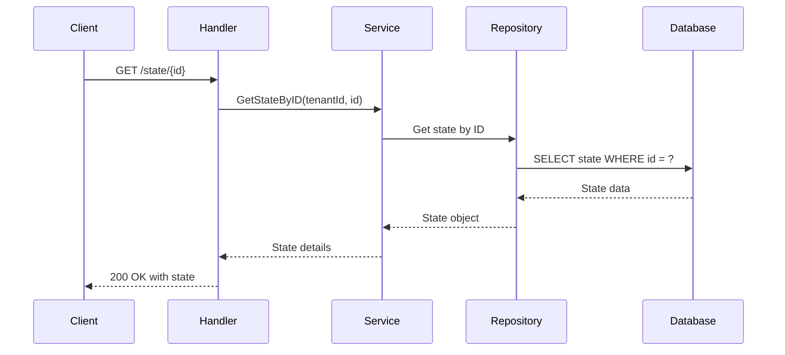

#### 13. Update State
- **Endpoint**: `PUT /workflow/v1/state/{id}`
- **Description**: Updates an existing state
- **Headers**: `X-Tenant-ID: {tenantId}`
- **Request Body**: State object with updated fields
- **Response**: `200 OK` with updated state

**Sequence Diagram:**

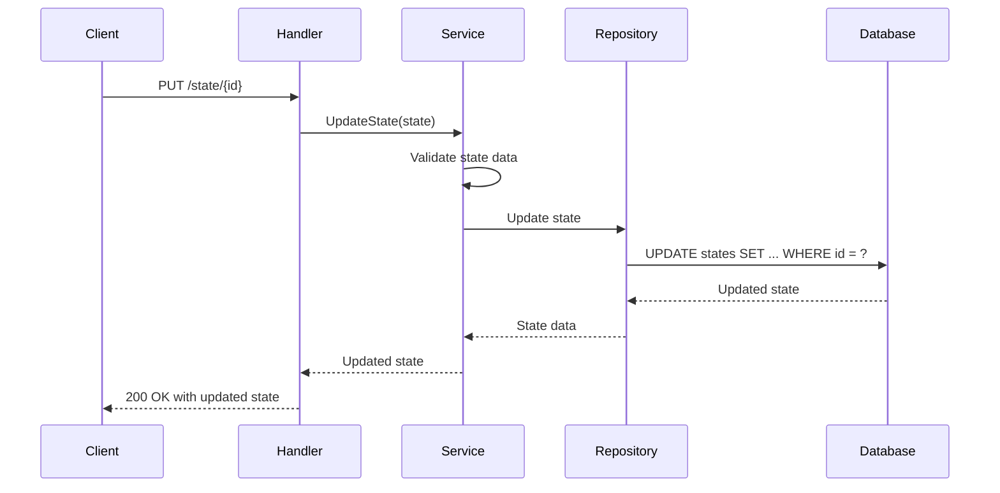

#### 14. Delete State
- **Endpoint**: `DELETE /workflow/v1/state/{id}`
- **Description**: Deletes a state and its associated actions
- **Response**: `204 No Content`

**Sequence Diagram:**

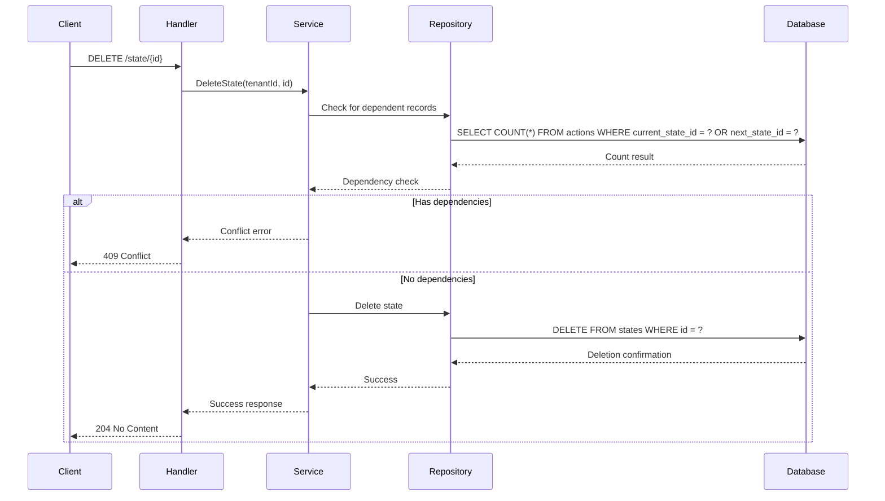

#### 15. Get Actions
- **Endpoint**: `GET /workflow/v1/state/{stateId}/action`
- **Description**: Retrieves all actions for a specific state
- **Query Parameters**:
  - `code` (optional, array)
- **Response**: `200 OK` with list of actions

**Sequence Diagram:**

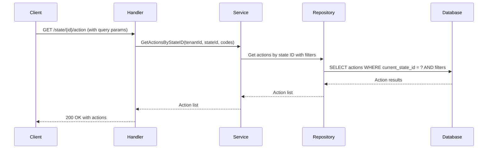

#### 16. Get Action by ID
- **Endpoint**: `GET /workflow/v1/action/{id}`
- **Description**: Retrieves a specific action by its ID
- **Response**: `200 OK` with action details

**Sequence Diagram:**

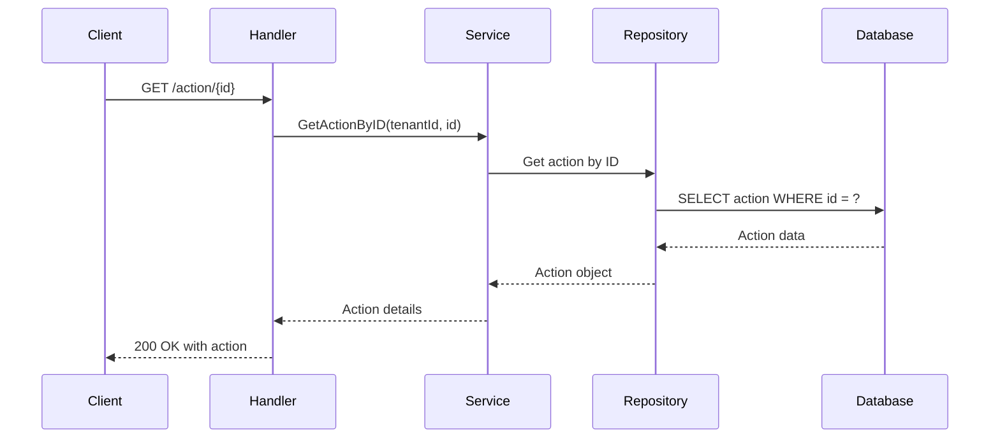

#### 17. Update Action
- **Endpoint**: `PUT /workflow/v1/action/{id}`
- **Description**: Updates an existing action
- **Headers**: `X-Tenant-ID: {tenantId}`
- **Request Body**: Action object with updated fields
- **Response**: `200 OK` with updated action

**Sequence Diagram:**

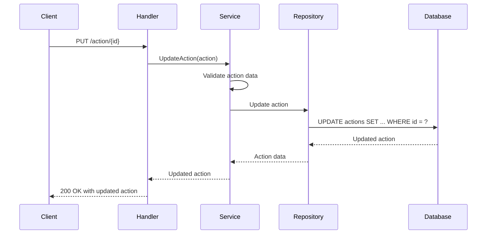

#### 18. Delete Action
- **Endpoint**: `DELETE /workflow/v1/action/{id}`
- **Description**: Deletes an action
- **Response**: `204 No Content`

**Sequence Diagram:**

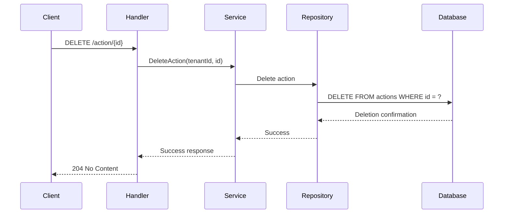

#### 19. Get Transitions
- **Endpoint**: `GET /workflow/v1/transition`
- **Description**: Retrieves the latest process instances filtered by entity, state, or assignee
- **Query Parameters**:
  - `entityId` (optional, requires `processId`)
  - `processId` (optional; required when `entityId` is used)
  - `currentStateId` (optional, UUID; mutually exclusive with `entityId` and `assigneeId`)
  - `assigneeId` (optional; mutually exclusive with `entityId` and `currentStateId`)
  - `history` (optional, boolean; only applicable when `entityId` is provided)
- **Response**: `200 OK` with matching process instances

**Sequence Diagram:**

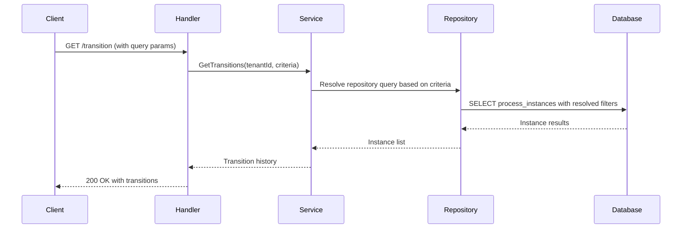

#### 20. Create Escalation Config
- **Endpoint**: `POST /workflow/v1/process/{processId}/escalation`
- **Description**: Creates a new escalation configuration for a process
- **Headers**: `X-Tenant-ID: {tenantId}`
- **Request Body**:
```json
{
  "processId": "process-uuid",
  "stateCode": "PENDING_REVIEW",
  "escalationAction": "AUTO_APPROVE",
  "stateSlaMinutes": 60,
  "processSlaMinutes": 1440
}
```
- **Response**: `201 Created` with created escalation config

**Sequence Diagram:**

```mermaid
sequenceDiagram
    participant Client
    participant Handler
    participant Service
    participant Repository
    participant Database

    Client->>Handler: POST /process/{id}/escalation
    Handler->>Service: CreateEscalationConfig(config)
    
    Service->>Service: Validate escalation config
    Service->>Repository: Create escalation config
    Repository->>Database: INSERT escalation_configs
    Database-->>Repository: Created config
    Repository-->>Service: Config data
    
    Service-->>Handler: Created config
    Handler-->>Client: 201 Created with config
```

#### 21. Get Escalation Configs
- **Endpoint**: `GET /workflow/v1/process/{processId}/escalation`
- **Description**: Retrieves escalation configurations for a process
- **Response**: `200 OK` with list of escalation configs

**Sequence Diagram:**

```mermaid
sequenceDiagram
    participant Client
    participant Handler
    participant Service
    participant Repository
    participant Database

    Client->>Handler: GET /process/{id}/escalation
    Handler->>Service: GetEscalationConfigsByProcessID(tenantId, processId)
    
    Service->>Repository: Get escalation configs by process
    Repository->>Database: SELECT escalation_configs WHERE process_id = ?
    Database-->>Repository: Config results
    Repository-->>Service: Config list
    
    Service-->>Handler: Escalation configs
    Handler-->>Client: 200 OK with configs
```

#### 22. Get Escalation Config by ID
- **Endpoint**: `GET /workflow/v1/escalation/{id}`
- **Description**: Retrieves a specific escalation configuration by its ID
- **Response**: `200 OK` with escalation config details

**Sequence Diagram:**

```mermaid
sequenceDiagram
    participant Client
    participant Handler
    participant Service
    participant Repository
    participant Database

    Client->>Handler: GET /escalation/{id}
    Handler->>Service: GetEscalationConfigByID(tenantId, id)
    
    Service->>Repository: Get escalation config by ID
    Repository->>Database: SELECT escalation_configs WHERE id = ?
    Database-->>Repository: Config data
    Repository-->>Service: Config object
    
    Service-->>Handler: Config details
    Handler-->>Client: 200 OK with config
```

#### 23. Update Escalation Config
- **Endpoint**: `PUT /workflow/v1/escalation/{id}`
- **Description**: Updates an existing escalation configuration
- **Headers**: `X-Tenant-ID: {tenantId}`
- **Request Body**: Escalation config object with updated fields
- **Response**: `200 OK` with updated escalation config

**Sequence Diagram:**

```mermaid
sequenceDiagram
    participant Client
    participant Handler
    participant Service
    participant Repository
    participant Database

    Client->>Handler: PUT /escalation/{id}
    Handler->>Service: UpdateEscalationConfig(config)
    
    Service->>Service: Validate escalation config
    Service->>Repository: Update escalation config
    Repository->>Database: UPDATE escalation_configs SET ... WHERE id = ?
    Database-->>Repository: Updated config
    Repository-->>Service: Config data
    
    Service-->>Handler: Updated config
    Handler-->>Client: 200 OK with updated config
```

#### 24. Delete Escalation Config
- **Endpoint**: `DELETE /workflow/v1/escalation/{id}`
- **Description**: Deletes an escalation configuration
- **Response**: `204 No Content`

**Sequence Diagram:**

```mermaid
sequenceDiagram
    participant Client
    participant Handler
    participant Service
    participant Repository
    participant Database

    Client->>Handler: DELETE /escalation/{id}
    Handler->>Service: DeleteEscalationConfig(tenantId, id)
    
    Service->>Repository: Delete escalation config
    Repository->>Database: DELETE FROM escalation_configs WHERE id = ?
    Database-->>Repository: Deletion confirmation
    Repository-->>Service: Success
    
    Service-->>Handler: Success response
    Handler-->>Client: 204 No Content
```

#### 25. Search Escalated Applications
- **Endpoint**: `GET /workflow/v1/auto/_search`
- **Description**: Searches for escalated process instances
- **Query Parameters**:
  - `processId` (optional)
  - `limit` (optional, default: 20)
  - `offset` (optional, default: 0)
- **Response**: `200 OK` with escalated instances

**Sequence Diagram:**

```mermaid
sequenceDiagram
    participant Client
    participant Handler
    participant Service
    participant Repository
    participant Database

    Client->>Handler: GET /auto/_search (with query params)
    Handler->>Service: SearchEscalatedApplications(tenantId, processId, limit, offset)
    
    Service->>Repository: Search escalated instances
    Repository->>Database: SELECT process_instances WHERE escalated = true AND filters
    Database-->>Repository: Instance results
    Repository-->>Service: Instance list
    
    Service-->>Handler: Escalated instances
    Handler-->>Client: 200 OK with escalated applications
```


### Error Codes

| HTTP Status | Error Code | Description |
|-------------|------------|-----------|
| 400 | BAD_REQUEST | Invalid request parameters |
| 401 | UNAUTHORIZED | Authentication required |
| 403 | FORBIDDEN | Insufficient permissions |
| 404 | NOT_FOUND | Resource not found |
| 409 | CONFLICT | Resource already exists |
| 422 | UNPROCESSABLE_ENTITY | Validation failed |
| 500 | INTERNAL_SERVER_ERROR | Server error |


## Project Structure

```
workflow/
├── api/                          # API layer
│   ├── handlers/                # HTTP handlers
│   └── routes.go                # Route definitions
├── cmd/server/                  # Application entrypoint
├── config/                      # Configuration management
├── db/migration/                # SQL migration files
├── internal/                    # Private application code
│   ├── migration/               # Migration runner
│   ├── models/                  # Domain models
│   ├── repository/              # Data access layer
│   │   └── postgres/           # PostgreSQL implementations
│   ├── security/               # Security and validation
│   └── service/                # Business logic
├── docker-compose.yml           # Docker compose configuration
├── Dockerfile                   # Docker image definition
├── go.mod                       # Go module definition
└── go.sum                       # Go module checksums
```


---

**Last Updated:** September 2025
**Version:** 1.0.0 
